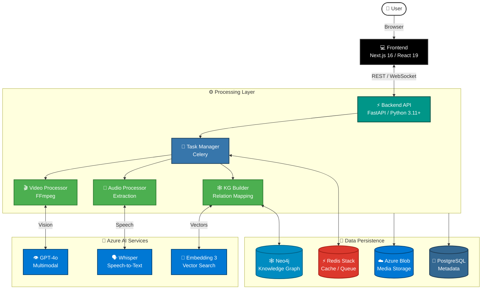

# QPrisma: Intelligent Multimedia Processing Platform

[](https://bestpractices.coreinfrastructure.org/projects/1)
[](https://bestpractices.coreinfrastructure.org/projects/1)
[](https://opensource.org/licenses/MIT)
[](https://www.python.org/downloads/)
[](https://nextjs.org/)
[](https://fastapi.tiangolo.com/)
[](https://azure.microsoft.com/en-us/products/ai-services/openai-service)

<p align="center">
  <a href="#solution-overview">Solution Overview</a> •
  <a href="#architecture">Architecture</a> •
  <a href="#key-features">Key Features</a> •
  <a href="#business-scenario">Business Scenario</a> •
  <a href="#getting-started">Getting Started</a> •
  <a href="#contributing">Contributing</a>
</p>

---

> [!IMPORTANT]
> **Responsible AI**: This solution leverages Azure OpenAI models (GPT-4o, Whisper). Users are responsible for ensuring their use of AI aligns with their organization's ethical guidelines and applicable laws. Review the [Azure OpenAI Transparency Note](https://learn.microsoft.com/en-us/legal/cognitive-services/openai/transparency-note) for more details.

## Solution Overview

**QPrisma** is an enterprise-grade, AI-powered multimedia processing platform designed to unlock insights from video and image content. By combining computer vision, Large Language Models (LLMs), and Retrieval-Augmented Generation (RAG), QPrisma transforms unstructured media into searchable, actionable knowledge.

Inspired by the [NVIDIA Video Search and Summarization Blueprint](https://developer.nvidia.com/blog/build-a-video-search-and-summarization-agent-with-nvidia-nim-blueprints/), this accelerator leverages Azure's robust cloud ecosystem to deliver scalable, production-ready multimedia analysis.

## Architecture

The solution implements a modern microservices architecture, separating the frontend user experience from the high-performance backend processing pipeline.



### Technology Stack

| Component | Technology | Description |
|-----------|------------|-------------|
| **Frontend** | Next.js 16, React 19 | Responsive, server-rendered UI with Tailwind CSS. |
| **Backend** | FastAPI, Python 3.11+ | High-performance async API with Pydantic validation. |
| **AI Models** | Azure OpenAI | GPT-4o (Vision/Chat), Whisper (Audio), text-embedding-3-large. |
| **Database** | PostgreSQL, Neo4j | Relational metadata and graph-based relationship mapping. |
| **Caching/Queue** | Redis, Celery | Task queue management and real-time state caching. |
| **Storage** | Azure Blob Storage | Scalable object storage for raw media assets. |
| **Infrastructure** | Azure Bicep, GitHub Actions | Infrastructure as Code and CI/CD pipelines. |
| **Deployment** | Azure Container Apps | Managed container orchestration with auto-scaling. |

## Key Features

*   **🎬 Advanced Video Analysis**: Automated frame extraction, scene detection, and visual understanding using GPT-4o Vision.
*   **🧠 Semantic Search & RAG**: Vector-based retrieval allows users to search for concepts ("show me safety violations") rather than just keywords.
*   **🕸️ Knowledge Graph Integration**: Maps entities and relationships within videos using Neo4j to understand context and connections.
*   **💬 Conversational Interface**: Chat with your media library using natural language to extract summaries, insights, and specific timestamps.
*   **🎥 Multi-Video Chat**: Select 2-10 videos and ask questions across all of them simultaneously. Compare videos, find common themes, and search your entire collection.
*   **⚡ Real-time Processing**: WebSocket-enabled status updates provide immediate feedback on long-running ingestion tasks.
*   **💰 Cost Optimization**: Integrated support for Azure OpenAI Batch API to reduce processing costs by up to 50% for non-urgent workloads.

## Business Scenario

Organizations today generate vast amounts of video data—from warehouse feeds to training materials—that remains "dark data" because it is difficult to search and analyze. QPrisma addresses these challenges:

| Use Case | Description | Business Value |
|----------|-------------|----------------|
| **SOP Validation** | Automatically analyze warehouse footage to verify adherence to Standard Operating Procedures. | Reduces compliance risks and improves safety standards. |
| **Digital Asset Management** | Search through hours of marketing or training video using natural language descriptions. | drastically reduces time spent retrieving specific clips. |
| **Smart Monitoring** | Detect anomalies or specific events in real-time within controlled environments. | Enhances operational efficiency and response times. |

## Getting Started

### Quick Start (5 minutes)

Get QPrisma running locally with these steps:

```bash
# 1. Clone and navigate to the repository
git clone https://github.com/alexandergg/QPrisma.git
cd QPrisma

# 2. Start required infrastructure (PostgreSQL, Neo4j, Redis)
docker-compose up -d

# 3. Configure backend environment
cp backend/.env.example backend/.env
# Edit backend/.env with your Azure OpenAI credentials

# 4. Start the backend API
cd backend
python3 -m pip install uv
uv venv
source .venv/bin/activate  # or .venv\Scripts\activate on Windows
uv pip install -e .
python api/main.py

# 5. In a new terminal, start the frontend
cd frontend
npm install
npm run dev
```

**Access the application:**
- Frontend: http://localhost:3000
- Backend API Docs: http://localhost:8000/docs
- Neo4j Browser: http://localhost:7474 (neo4j/qprisma123)

### Prerequisites

*   **Operating System**: Windows, macOS, or Linux
*   **Runtime**: [Python 3.11+](https://www.python.org/), [Node.js 20+](https://nodejs.org/)
*   **Virtualization**: [Docker Desktop](https://www.docker.com/products/docker-desktop/)
*   **Cloud Access**: Azure Subscription with access to Azure OpenAI Service.

### Azure Services & Quotas
Ensure you have the following Azure resources provisioned:
*   **Azure OpenAI**: Deployments for `gpt-4o`, `whisper`, and `text-embedding-3-large`.
*   **Azure Blob Storage**: A standard storage account.

### Installation

1.  **Clone the repository**
    ```bash
    git clone https://github.com/yourusername/qprisma.git
    cd qprisma
    ```

2.  **Start Infrastructure**
    Launch the required databases (PostgreSQL, Neo4j, Redis) using Docker.
    ```bash
    docker-compose up -d
    ```

3.  **Configure Environment**
    Create your environment files from the provided templates.
    ```bash
    # Backend Configuration
    cp backend/.env.example backend/.env
    
    # Frontend Configuration
    cp frontend/.env.local.example frontend/.env.local
    ```
    > **Note**: Edit `backend/.env` to include your Azure OpenAI API keys and endpoints.
    >
    > **Optional (semantic long-term memory with Mem0)**:
    > - `MEM0_ENABLED=true` to turn it on
    > - `MEM0_API_KEY=...` only if using Mem0 Cloud (not required for local/self-hosted)
    > - `MEM0_TOP_K=5` to control retrieved memories per turn

4.  **Launch Backend**
    ```bash
    cd backend
    pip install uv  # Fast package manager
    uv pip install -e .
    
    # Activate virtual environment
    source .venv/bin/activate  # Linux/Mac
    # .venv\Scripts\activate   # Windows
    
    python api/main.py
    ```
    *API Swagger docs available at: http://localhost:8000/docs*

5.  **Launch Frontend**
    ```bash
    cd frontend
    npm install
    npm run dev
    ```
    *Application available at: http://localhost:3000*

## Project Structure

```bash
qprisma/
├── backend/                # FastAPI Application
│   ├── api/               # Routes (14 modules) and Dependencies
│   ├── agent/             # LangGraph Agent System
│   │   ├── graphs/        # StateGraph definitions (video, editor)
│   │   ├── nodes/         # Graph node implementations
│   │   ├── state/         # State definitions with reducers
│   │   ├── tools/         # @tool implementations (general, editor)
│   │   └── utils/         # Formatting and observability helpers
│   ├── core/              # Config, logging, exceptions, async utils
│   ├── services/          # Core Business Logic (24 services)
│   ├── models/            # Data Models (Pydantic, SQLModel)
│   ├── evaluation/        # Benchmark framework (Video-MME, MLVU)
│   └── tasks/             # Async Workers (Celery)
├── frontend/               # Next.js 16 Application
│   ├── app/               # App Router Pages
│   ├── components/        # Reusable UI Components
│   └── lib/               # Utility Functions and API Client
├── infra/                  # Azure Infrastructure as Code
│   ├── main.bicep         # Bicep orchestrator (12 modules)
│   ├── modules/           # ACR, ACA, AI Foundry, PostgreSQL, Redis, Neo4j, etc.
│   └── parameters/        # Environment-specific parameters
├── .github/
│   ├── workflows/         # CI/CD (ci, build-and-push, deploy-infra, deploy-app)
│   └── actions/           # Reusable composite actions (setup-backend, setup-frontend)
├── docs/                   # Architecture and Infrastructure documentation
├── scripts/                # Azure setup and lifecycle scripts
└── docker-compose.yml     # Local Dev Infrastructure
```

## Troubleshooting

### Backend Issues

**Problem: "Module not found" errors**
```bash
# Ensure you're in the virtual environment
source backend/.venv/bin/activate  # Linux/Mac
.venv\Scripts\activate              # Windows

# Reinstall dependencies
cd backend
uv pip install -e .
```

**Problem: "Connection refused" to PostgreSQL/Neo4j/Redis**
```bash
# Verify Docker containers are running
docker ps

# If not running, start infrastructure
docker-compose up -d

# Check container logs
docker-compose logs postgres
docker-compose logs neo4j
docker-compose logs redis
```

**Problem: Azure OpenAI API errors**
- Verify your `AZURE_OPENAI_ENDPOINT` and `AZURE_OPENAI_API_KEY` in `backend/.env`
- Ensure deployments exist in Azure OpenAI Studio for:
  - `gpt-4o` (or your deployment name)
  - `text-embedding-3-large`
  - `whisper`
- Check that `AZURE_OPENAI_API_VERSION` matches your deployment (e.g., `2024-08-01-preview`)

**Problem: Mem0 memory not being used**
- Verify `MEM0_ENABLED=true` in `backend/.env`
- For Mem0 Cloud, verify `MEM0_API_KEY` is valid
- For local/self-hosted Mem0, `MEM0_API_KEY` can be empty
- If Mem0 SDK is missing, the agent falls back gracefully to local compact memory + artifact refs

**Problem: FFmpeg not found**
```bash
# Install FFmpeg
# Ubuntu/Debian
sudo apt-get install ffmpeg

# macOS
brew install ffmpeg

# Windows: Download from https://ffmpeg.org/download.html
# and add to PATH
```

### Frontend Issues

**Problem: "Cannot connect to backend API"**
- Verify backend is running at http://localhost:8000
- Check `NEXT_PUBLIC_API_URL` in `frontend/.env.local`
- Try accessing http://localhost:8000/docs to test backend

**Problem: Build errors with Next.js**
```bash
cd frontend
# Clear cache and reinstall
rm -rf .next node_modules package-lock.json
npm install
npm run build
```

### Database Issues

**Problem: PostgreSQL connection errors**
```bash
# Reset PostgreSQL container
docker-compose down
docker-compose up -d postgres

# Wait for initialization (check logs)
docker-compose logs -f postgres
```

**Problem: Neo4j authentication failed**
- Default credentials: `neo4j` / `qprisma123`
- Access Neo4j Browser at http://localhost:7474
- Update credentials in `backend/.env` if changed

### Performance Issues

**Problem: Video processing is slow**
- Enable hardware acceleration in `FFmpegProcessingConfig`
- Use batch API for non-urgent processing (50% cost savings)
- Adjust frame extraction rate (lower FPS = faster processing)

**Problem: High memory usage**
- Process videos in smaller batches
- Enable caching with Redis
- Consider using storage tiering for large files

## Azure Deployment

QPrisma includes full Infrastructure as Code and CI/CD for deployment to Azure Container Apps.

### CI/CD Pipeline

```
Push to main → CI (lint/test) → Build & Push Images → Deploy to Azure Container Apps
                                                        ↓
infra/** changes → Deploy Infrastructure (Bicep) ─────────
```

| Workflow | Trigger | Purpose |
|----------|---------|---------|
| `ci.yml` | Push/PR to `main` | Backend lint/test + Frontend lint/typecheck/test |
| `build-and-push.yml` | Push to `main` (path-filtered) | Build Docker images, push to ACR |
| `deploy-infra.yml` | Push to `main` (`infra/**`) | Provision Azure resources via Bicep |
| `deploy-app.yml` | Auto-triggered after build | Rolling deployment with health checks + rollback |

### Azure Resources

The infrastructure is defined in `infra/` using Azure Bicep (12 modules):

- **Compute**: 3 Container Apps (API, Frontend, Worker) + Neo4j in managed environment with VNet
- **AI**: Azure AI Foundry with GPT-4o, GPT-5.2-chat, Whisper, text-embedding-3-large
- **Data**: PostgreSQL Flexible Server, Azure Managed Redis Enterprise, Azure Blob Storage
- **Security**: Key Vault (RBAC + managed identity), Container Registry
- **Observability**: Log Analytics workspace (30-day retention)

For detailed infrastructure and CI/CD documentation, see **[Infrastructure Guide](./docs/INFRASTRUCTURE.md)**.

## Documentation

*   **[API Documentation](./API_DOCUMENTATION.md)** - Complete REST API reference with examples
*   **[Architecture Deep Dive](./docs/ARCHITECTURE.md)** - System architecture, pipelines, and algorithms
*   **[Infrastructure & CI/CD Guide](./docs/INFRASTRUCTURE.md)** - Azure deployment, Bicep IaC, and CI/CD pipelines
*   **[Testing Guide](./TESTING.md)** - Testing standards and best practices
*   **[Contributing Guide](./CONTRIBUTING.md)** - How to contribute to QPrisma
*   **[Changelog](./CHANGELOG.md)** - Version history and release notes
*   **[Security Policy](./SECURITY.md)** - Security guidelines and vulnerability reporting
*   **[Code of Conduct](./CODE_OF_CONDUCT.md)** - Community guidelines
*   **[Interactive API Docs](http://localhost:8000/docs)** - Swagger UI (requires backend running)
*   **[AI Agent Guide](.claude/README.md)** - Guide to using the built-in Claude Code commands and agents

## Contributing

We welcome contributions to QPrisma! Please review our [Contributing Guide](./CONTRIBUTING.md) for details on our [Code of Conduct](./CODE_OF_CONDUCT.md) and development process.

## License

This project is licensed under the [MIT License](./LICENSE).

## Disclaimers

This project is a solution accelerator and is provided "as-is" without warranty of any kind. It is intended to serve as a starting point for your own custom implementation.

**Trademarks**: This project may contain trademarks or logos for projects, products, or services. Authorized use of Microsoft trademarks or logos is subject to and must follow [Microsoft's Trademark & Brand Guidelines](https://www.microsoft.com/en-us/legal/intellectualproperty/trademarks). Use of Microsoft trademarks or logos in modified versions of this project must not cause confusion or imply Microsoft sponsorship.
