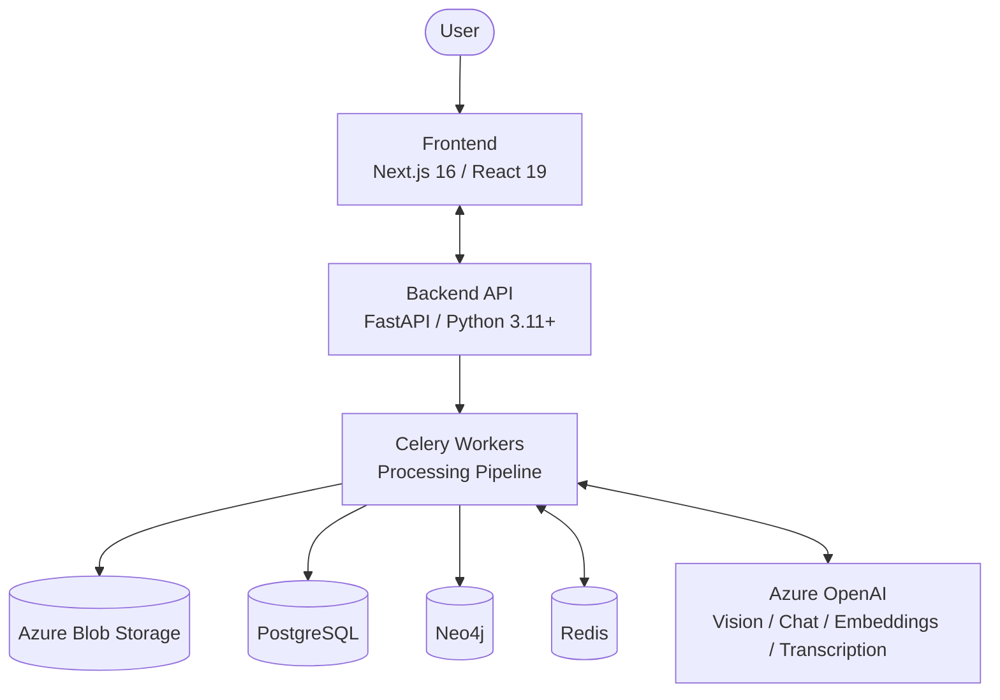

# QPrisma: AI Video Intelligence Accelerator

[](https://bestpractices.coreinfrastructure.org/projects/1)
[](https://opensource.org/licenses/MIT)
[](https://www.python.org/downloads/)
[](https://nextjs.org/)
[](https://fastapi.tiangolo.com/)
[](https://azure.microsoft.com/en-us/products/ai-services/openai-service)

<p align="center">
  <a href="#what-qprisma-solves">What QPrisma Solves</a> •
  <a href="#core-capabilities">Core Capabilities</a> •
  <a href="#architecture">Architecture</a> •
  <a href="#quick-start-local">Quick Start</a> •
  <a href="#azure-deployment">Azure Deployment</a> •
  <a href="#documentation">Documentation</a>
</p>

---

> [!IMPORTANT]
> **Responsible AI**: QPrisma uses Azure OpenAI models (including multimodal and transcription models). You are responsible for compliant, ethical use in your organization. See the [Azure OpenAI Transparency Note](https://learn.microsoft.com/en-us/legal/cognitive-services/openai/transparency-note).

## What QPrisma Solves

QPrisma is an enterprise-ready platform for turning large video libraries into searchable operational knowledge.

It ingests media, extracts visual/audio context, builds semantic and graph indexes, and lets teams query the content in natural language for fast investigation, compliance verification, and decision support.

### Typical outcomes

- Reduce time-to-insight from hours of manual review to conversational lookup.
- Improve traceability with timestamped evidence from video and audio.
- Reuse institutional knowledge through structured memory and retrieval.

## Core Capabilities

- **Video understanding**: Frame-level analysis, scene structure, and multimodal interpretation.
- **Conversational retrieval (RAG)**: Ask natural language questions across one or many videos.
- **Knowledge graph enrichment**: Capture entities and relationships for contextual search.
- **Multi-video chat**: Compare findings across selected assets in one query flow.
- **Async processing at scale**: Queue-based background processing with live status updates.
- **Cost-aware processing**: Batch-friendly architecture for non-urgent workloads.

### Memory and Context Engineering

QPrisma uses layered memory to maintain answer quality on long workflows:

- **Operational state** via LangGraph checkpointer (resume/retry continuity).
- **Full tool payload artifacts** in Redis + Blob + PostgreSQL metadata.
- **Semantic summaries** via optional Mem0 integration.
- **Prompt-time ranking** with recency and semantic/lexical signals.

## Architecture



### Technology Stack

| Area | Technology |
|---|---|
| Frontend | Next.js 16, React 19, Tailwind |
| Backend | FastAPI, Python 3.11+, Pydantic |
| Agent Runtime | LangGraph (video + editor agents) |
| AI | Azure OpenAI multimodal/chat/embedding/transcription models |
| Data | PostgreSQL, Neo4j, Redis |
| Storage | Azure Blob Storage |
| Infrastructure | Bicep, GitHub Actions, Azure Container Apps |

## Quick Start (Local)

### Prerequisites

- Python 3.11+
- Node.js 20+
- Docker Desktop
- Azure subscription and Azure OpenAI access

### 1) Start local infrastructure

```bash
git clone https://github.com/alexandergg/QPrisma.git
cd QPrisma
docker-compose up -d
```

### 2) Configure environment files

```bash
# from repository root
cp backend/.env.example backend/.env
cp frontend/.env.local.example frontend/.env.local
```

Update `backend/.env` with your Azure settings and required service credentials.

### 3) Run backend

```bash
cd backend
python -m pip install uv
uv venv

# Windows
.venv\Scripts\activate

# macOS/Linux
# source .venv/bin/activate

uv pip install -e .
python api/main.py
```

### 4) Run frontend

```bash
cd frontend
npm install
npm run dev
```

### Local endpoints

- Frontend: http://localhost:3000
- API docs: http://localhost:8000/docs
- Neo4j Browser: http://localhost:7474

## Repository Layout

```text
backend/
  api/           # FastAPI routes and dependency wiring
  agent/         # LangGraph graphs, nodes, tools, prompts
  services/      # Business logic services
  models/        # Pydantic/DB models
  tasks/         # Celery workers
  evaluation/    # Benchmarks and evaluation framework
frontend/
  app/           # Next.js App Router
  components/    # React components
  lib/           # API client and utilities
infra/
  main.bicep     # Root IaC orchestrator
  modules/       # Azure resource modules
  parameters/    # Environment parameter files
```

## Troubleshooting

### Backend cannot start

- Ensure virtual environment is activated.
- Reinstall dependencies with `uv pip install -e .`.
- Verify Docker services are running: `docker ps`.

### Frontend cannot reach backend

- Confirm backend is up at http://localhost:8000/docs.
- Verify `NEXT_PUBLIC_API_URL` in `frontend/.env.local`.

### Azure OpenAI errors

- Validate endpoint/key/API version in `backend/.env`.
- Confirm model deployments exist and names match configuration.

## Azure Deployment

QPrisma includes production-oriented Azure deployment assets:

- **IaC**: Bicep modules under `infra/`
- **Runtime**: Azure Container Apps (API, Frontend, Worker)
- **CI/CD**: GitHub Actions workflows for test, build, infra deploy, and app deploy

### CI/CD workflows

| Workflow | Purpose |
|---|---|
| `ci.yml` | Backend + frontend quality checks |
| `build-and-push.yml` | Build and push container images |
| `deploy-infra.yml` | Provision/update Azure infrastructure |
| `deploy-app.yml` | Deploy application revisions with health checks |

For full details, see [docs/INFRASTRUCTURE.md](./docs/INFRASTRUCTURE.md).

## Evaluation

Run benchmark and ablation workflows from `backend/evaluation/` to measure retrieval and answer quality.

Start with:

```bash
cd backend
python -m evaluation.run_evaluation --config evaluation/configs/default.yaml
```

## Documentation

- [API Documentation](./API_DOCUMENTATION.md)
- [Architecture Deep Dive](./docs/ARCHITECTURE.md)
- [Infrastructure Guide](./docs/INFRASTRUCTURE.md)
- [Testing Guide](./TESTING.md)
- [Contributing Guide](./CONTRIBUTING.md)
- [Changelog](./CHANGELOG.md)
- [Security Policy](./SECURITY.md)
- [Code of Conduct](./CODE_OF_CONDUCT.md)

## Contributing

Contributions are welcome. Please review [CONTRIBUTING.md](./CONTRIBUTING.md) before opening a pull request.

## License

This project is licensed under the [MIT License](./LICENSE).

## Disclaimer

QPrisma is a solution accelerator provided "as-is" without warranties. It is intended as a foundation for custom enterprise implementations.