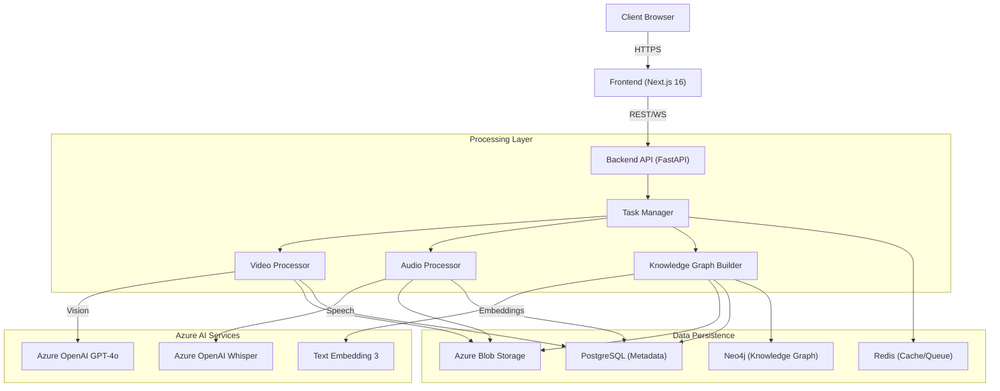

# QPrisma: Intelligent Multimedia Processing Platform

[](https://opensource.org/licenses/MIT)
[](https://www.python.org/downloads/)
[](https://nextjs.org/)
[](https://fastapi.tiangolo.com/)
[](https://azure.microsoft.com/en-us/products/ai-services/openai-service)

<p align="center">
  <a href="#solution-overview">Solution Overview</a> •
  <a href="#architecture">Architecture</a> •
  <a href="#key-features">Key Features</a> •
  <a href="#business-scenario">Business Scenario</a> •
  <a href="#getting-started">Getting Started</a> •
  <a href="#contributing">Contributing</a>
</p>

---

> [!IMPORTANT]
> **Responsible AI**: This solution leverages Azure OpenAI models (GPT-4o, Whisper). Users are responsible for ensuring their use of AI aligns with their organization's ethical guidelines and applicable laws. Review the [Azure OpenAI Transparency Note](https://learn.microsoft.com/en-us/legal/cognitive-services/openai/transparency-note) for more details.

## Solution Overview

**QPrisma** is an enterprise-grade, AI-powered multimedia processing platform designed to unlock insights from video and image content. By combining computer vision, Large Language Models (LLMs), and Retrieval-Augmented Generation (RAG), QPrisma transforms unstructured media into searchable, actionable knowledge.

Inspired by the [NVIDIA Video Search and Summarization Blueprint](https://developer.nvidia.com/blog/build-a-video-search-and-summarization-agent-with-nvidia-nim-blueprints/), this accelerator leverages Azure's robust cloud ecosystem to deliver scalable, production-ready multimedia analysis.

## Architecture

The solution implements a modern microservices architecture, separating the frontend user experience from the high-performance backend processing pipeline.



### Technology Stack

| Component | Technology | Description |
|-----------|------------|-------------|
| **Frontend** | Next.js 16, React 19 | Responsive, server-rendered UI with Tailwind CSS. |
| **Backend** | FastAPI, Python 3.11+ | High-performance async API with Pydantic validation. |
| **AI Models** | Azure OpenAI | GPT-4o (Vision/Chat), Whisper (Audio), text-embedding-3-large. |
| **Database** | PostgreSQL, Neo4j | Relational metadata and graph-based relationship mapping. |
| **Caching/Queue** | Redis, Celery | Task queue management and real-time state caching. |
| **Storage** | Azure Blob Storage | Scalable object storage for raw media assets. |

## Key Features

*   **🎬 Advanced Video Analysis**: Automated frame extraction, scene detection, and visual understanding using GPT-4o Vision.
*   **🧠 Semantic Search & RAG**: Vector-based retrieval allows users to search for concepts ("show me safety violations") rather than just keywords.
*   **🕸️ Knowledge Graph Integration**: Maps entities and relationships within videos using Neo4j to understand context and connections.
*   **💬 Conversational Interface**: Chat with your media library using natural language to extract summaries, insights, and specific timestamps.
*   **⚡ Real-time Processing**: WebSocket-enabled status updates provide immediate feedback on long-running ingestion tasks.
*   **💰 Cost Optimization**: Integrated support for Azure OpenAI Batch API to reduce processing costs by up to 50% for non-urgent workloads.

## Business Scenario

Organizations today generate vast amounts of video data—from warehouse feeds to training materials—that remains "dark data" because it is difficult to search and analyze. QPrisma addresses these challenges:

| Use Case | Description | Business Value |
|----------|-------------|----------------|
| **SOP Validation** | Automatically analyze warehouse footage to verify adherence to Standard Operating Procedures. | Reduces compliance risks and improves safety standards. |
| **Digital Asset Management** | Search through hours of marketing or training video using natural language descriptions. | drastically reduces time spent retrieving specific clips. |
| **Smart Monitoring** | Detect anomalies or specific events in real-time within controlled environments. | Enhances operational efficiency and response times. |

## Getting Started

### Prerequisites

*   **Operating System**: Windows, macOS, or Linux
*   **Runtime**: [Python 3.11+](https://www.python.org/), [Node.js 20+](https://nodejs.org/)
*   **Virtualization**: [Docker Desktop](https://www.docker.com/products/docker-desktop/)
*   **Cloud Access**: Azure Subscription with access to Azure OpenAI Service.

### Azure Services & Quotas
Ensure you have the following Azure resources provisioned:
*   **Azure OpenAI**: Deployments for `gpt-4o`, `whisper`, and `text-embedding-3-large`.
*   **Azure Blob Storage**: A standard storage account.

### Installation

1.  **Clone the repository**
    ```bash
    git clone https://github.com/yourusername/qprisma.git
    cd qprisma
    ```

2.  **Start Infrastructure**
    Launch the required databases (PostgreSQL, Neo4j, Redis) using Docker.
    ```bash
    docker-compose up -d
    ```

3.  **Configure Environment**
    Create your environment files from the provided templates.
    ```bash
    # Backend Configuration
    cp backend/.env.example backend/.env
    
    # Frontend Configuration
    cp frontend/.env.local.example frontend/.env.local
    ```
    > **Note**: Edit `backend/.env` to include your Azure OpenAI API keys and endpoints.

4.  **Launch Backend**
    ```bash
    cd backend
    pip install uv  # Fast package manager
    uv pip install -e .
    
    # Activate virtual environment
    source .venv/bin/activate  # Linux/Mac
    # .venv\Scripts\activate   # Windows
    
    python api/main.py
    ```
    *API Swagger docs available at: http://localhost:8000/docs*

5.  **Launch Frontend**
    ```bash
    cd frontend
    npm install
    npm run dev
    ```
    *Application available at: http://localhost:3000*

## Project Structure

```bash
qprisma/
├── backend/                # FastAPI Application
│   ├── api/               # Routes and Controllers
│   ├── services/          # Core Business Logic (AI, Processing)
│   ├── models/            # Data Models (Pydantic, SQLModel)
│   └── tasks/             # Async Workers (Celery)
├── frontend/               # Next.js Application
│   ├── app/               # App Router Pages
│   ├── components/        # Reusable UI Components
│   └── lib/               # Utility Functions
├── scripts/                # DevOps & Setup Scripts
└── docker-compose.yml     # Local Dev Infrastructure
```

## Documentation

*   [Development Roadmap](./DEVELOPMENT_ROADMAP.md) - Future plans and milestone tracking.
*   [Frontend UX Redesign](./FRONTEND_UX_REDESIGN.md) - Detailed design specifications.
*   [API Documentation](http://localhost:8000/docs) - Interactive API reference (requires backend running).

## Contributing

We welcome contributions to QPrisma! Please review our [Contributing Guide](./CONTRIBUTING.md) for details on our code of conduct and development process.

## License

This project is licensed under the [MIT License](./LICENSE).

## Disclaimers

This project is a solution accelerator and is provided "as-is" without warranty of any kind. It is intended to serve as a starting point for your own custom implementation.

**Trademarks**: This project may contain trademarks or logos for projects, products, or services. Authorized use of Microsoft trademarks or logos is subject to and must follow [Microsoft's Trademark & Brand Guidelines](https://www.microsoft.com/en-us/legal/intellectualproperty/trademarks). Use of Microsoft trademarks or logos in modified versions of this project must not cause confusion or imply Microsoft sponsorship.