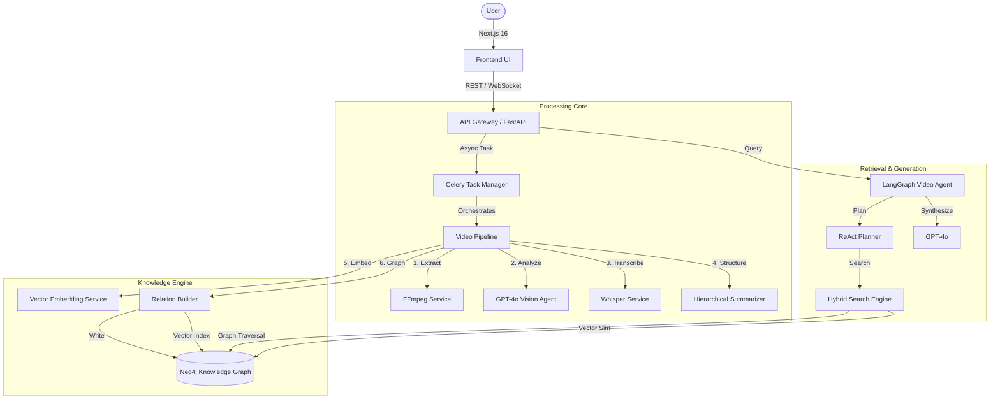

# QPrisma Architecture & Technical Deep Dive

This document provides a comprehensive technical analysis of the QPrisma platform. It details the system architecture, processing pipelines, knowledge graph implementation, and the algorithmic foundations inspired by state-of-the-art VideoRAG research.

## 1. System Architecture Overview

QPrisma implements a **Microservices-based Modular Architecture** designed for scalability and high-throughput multimedia processing.



### Core Technologies
- **Runtime**: Python 3.11+ (Backend), Node.js 20+ (Frontend)
- **Frameworks**: FastAPI, Next.js 16, LangGraph, Celery
- **AI/ML**: Azure AI Foundry (GPT-4o, GPT-5.2-chat, Whisper, text-embedding-3-large)
- **Databases**: PostgreSQL (Metadata), Neo4j (Graph + Vector), Redis Enterprise (Cache/Queue)
- **Infrastructure**: Azure Container Apps, Azure Bicep IaC, GitHub Actions CI/CD
- **Storage**: Azure Blob Storage

---

## 2. Video Processing Pipeline (The "Dual-Channel" Approach)

QPrisma employs a sophisticated "Dual-Channel" processing pipeline designed to balance **speed**, **cost**, and **semantic depth**.

### 2.1. Ingestion & Extraction
*   **High-Performance Upload**: Chunked upload handling for 1GB+ files directly to Azure Blob Storage.
*   **Adaptive Frame Extraction**:
    *   **FFmpeg (Primary)**: Uses hardware-accelerated decoding to extract keyframes at configurable intervals (default: 1 FPS).
    *   **OpenCV (Fallback)**: Python-native fallback for granular frame access.
*   **Audio Separation**: Concurrent audio stream extraction for independent transcription.

### 2.2. Visual Analysis (Batch API Optimization)
To mitigate the high cost and latency of frame-by-frame analysis, QPrisma utilizes the **Azure OpenAI Batch API**.
*   **Cost Reduction**: ~50% savings vs. standard synchronous API.
*   **Throughput**: Parallel processing of thousands of frames without hitting standard rate limits.
*   **Prompt Engineering**: Each frame is analyzed with a specialized "RAG-Optimized" prompt that extracts:
    *   Scene Description (Lighting, Environment)
    *   On-screen Text (OCR)
    *   Detected Entities (People, Objects)
    *   Actions/Narrative Flow

### 2.3. Hierarchical Context Encoding
Inspired by [VideoRAG](https://github.com/HKUDS/VideoRAG), QPrisma builds context at multiple levels to handle the "Lost in the Middle" phenomenon in long videos.

1.  **Frame Level**: Raw visual embeddings and dense captions.
2.  **Scene Level**: Aggregated summaries of sequential frames with high visual similarity.
3.  **Chapter Level**: Semantic grouping of scenes (e.g., "Introduction", "Demo Section").
4.  **Video Level**: Global executive summary and topic extraction.

**Technique**: `HierarchicalSummarizer` service recursively summarizes lower levels to build higher-level representations, ensuring global queries ("What is this video about?") are as fast as specific ones.

---

## 3. Knowledge Graph Architecture

QPrisma moves beyond simple Vector RAG by implementing a **GraphRAG** approach using Neo4j. This allows capturing structured relationships that vector similarity misses.

### 3.1. Graph Schema
The graph models the video structure and its semantic contents explicitly:

```cypher
(:Video)-[:HAS_CHAPTER]->(:Chapter)
(:Chapter)-[:HAS_SCENE]->(:Scene)
(:Scene)-[:HAS_FRAME]->(:Frame)
(:Frame)-[:CONTAINS_ENTITY]->(:Entity)
(:Entity)-[:APPEARS_WITH]->(:Entity)
(:Entity)-[:INTERACTS_WITH]->(:Entity)
```

### 3.2. Relationship Extraction (`RelationBuilder`)
The `RelationBuilder` service infers edges between nodes using three strategies:
1.  **Temporal**: `BEFORE`, `AFTER`, `DURING` (based on timestamps).
2.  **Co-occurrence**: `APPEARS_WITH` (entities appearing in the same frames).
3.  **Semantic**: `INTERACTS_WITH`, `RELATES_TO` (inferred by GPT-4o from context).

### 3.3. Hybrid Indexing
QPrisma uses **Neo4j Vector Index** to store embeddings on `Frame` and `Scene` nodes.
*   **Vector Search**: Finds conceptually similar moments ("show me someone happy").
*   **Graph Traversal**: Navigates relationships ("who is the person happy *with*?").

---

## 4. Algorithmic Deep Dive: Retrieval-Augmented Generation (RAG)

### 4.1. Hybrid Search Strategy
The search engine (`EnhancedSearch`) combines results from three sources:
1.  **Vector Similarity**: `cosine_similarity(query_embedding, frame_embedding)`
2.  **Full-Text Search**: Keyword matching on OCR and Transcripts (BM25-like).
3.  **Graph Traversal**: 2-hop neighbor expansion to find contextually relevant entities.

**Formula**:
$$ Score_{final} = \alpha \cdot Score_{vector} + \beta \cdot Score_{text} + \gamma \cdot Score_{graph} $$

### 4.2. LangGraph Orchestration
The "Brain" of QPrisma is a **LangGraph StateGraph** that manages the cognitive architecture:

*   **Nodes**: `Planner`, `Search`, `Synthesize`, `Critique`.
*   **Edges**: Conditional logic to loop back if information is missing (ReAct pattern).
*   **Memory**: Redis-backed `CheckpointSaver` allows pausing/resuming long-running research tasks.
*   **Human-in-the-loop**: `interrupt_before` capability allows users to guide the agent during complex edits.

---

## 5. Technical Stack Details

### Backend (`backend/`)
*   **FastAPI**: For high-concurrency async endpoints.
*   **Pydantic**: Strict data validation and serialization.
*   **Celery**: Distributed task queue for long-running video processing.
*   **Redis Stack**: Used for Caching, Pub/Sub (WebSockets), and Vector storage (optional).

### Frontend (`frontend/`)
*   **Next.js 16 (App Router)**: Server-side rendering for performance.
*   **React 19**: Utilizing Server Components and Actions.
*   **Tailwind CSS 4**: Modern utility-first styling.
*   **ReactFlow**: Visualizing the Knowledge Graph and Video/Editor pipelines.

---

## 6. Deployment Architecture

QPrisma deploys to **Azure Container Apps** using Infrastructure as Code (Bicep) and GitHub Actions CI/CD.

### 6.1. Azure Container Apps

Three application containers run in a VNet-enabled managed environment:

| Container | Role | Scaling | Ingress |
|-----------|------|---------|---------|
| **API** (FastAPI) | REST/WebSocket server | 1–2 replicas (HTTP concurrency) | External HTTPS |
| **Frontend** (Next.js) | SSR web application | 1–2 replicas (HTTP concurrency) | External HTTPS |
| **Worker** (Celery) | Background video processing | 1–3 replicas (KEDA Redis queue scaler) | Internal only |
| **Neo4j** | Knowledge Graph database | 1 replica (fixed) | Internal TCP (Bolt 7687) |

### 6.2. CI/CD Pipeline

```
Code Push → CI (lint/test) → Build Docker Images → Push to ACR → Deploy to ACA
Infra Push → Validate Bicep → What-If → Deploy Azure Resources
```

Four GitHub Actions workflows form the pipeline:
1. **`ci.yml`**: 5 parallel jobs (backend lint/test, frontend lint/typecheck/test)
2. **`build-and-push.yml`**: Path-filtered builds, GHA layer caching, auto-triggers deployment
3. **`deploy-infra.yml`**: Bicep validation → What-If → Deploy with retry logic
4. **`deploy-app.yml`**: Rolling updates with health checks and automatic rollback

Key patterns: OIDC authentication, stale deployment cancellation, AI Foundry provisioning wait loop, revision-based rollback.

### 6.3. Multi-Region Strategy

| Region | Resources | Rationale |
|--------|-----------|-----------|
| West Europe | Container Apps, Redis, Storage, Key Vault | User proximity |
| Sweden Central | AI Foundry (GPT-4o, GPT-5.2, Whisper, Embeddings) | Model availability |
| North Europe | PostgreSQL Flexible Server | Service availability |

### 6.4. Security Architecture

- **Managed Identity**: API and Worker apps use system-assigned identities for Key Vault access
- **OIDC Federation**: GitHub Actions authenticate via federated credentials (no stored secrets)
- **Key Vault**: RBAC-authorized secrets for JWT keys, with "Key Vault Secrets User" role grants
- **TLS**: All external traffic encrypted; Redis Enterprise requires TLS 1.2+

For detailed infrastructure documentation, see [`docs/INFRASTRUCTURE.md`](./INFRASTRUCTURE.md).

---

## 7. References & Inspiration

This architecture draws inspiration from the following research:
*   **VideoRAG**: *"VideoRAG: Knowledge-Graph-Enhanced Retrieval-Augmented Generation for Video Understanding"* (HKUDS).
    *   *Adoption*: Graph-driven indexing and hierarchical encoding.
*   **GraphRAG**: Microsoft Research's approach to global dataset understanding.
    *   *Adoption*: Summary-based community detection (Chapters/Scenes).
*   **LangGraph**: LangChain's graph-based agent runtime.
    *   *Adoption*: Cyclic state management for the Video Agent.
