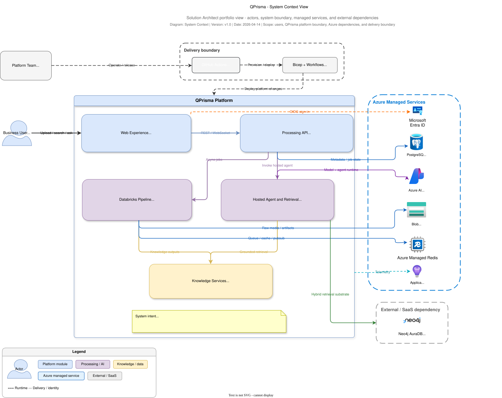

# QPrisma Architecture Portfolio

This document is the entry point for the QPrisma architecture documentation set.

Its purpose is to help a Solution Architect, reviewer, or stakeholder answer the right question with the right artifact instead of trying to extract every concern from a single diagram or a single deep-dive document.

## Why this portfolio exists

QPrisma spans several architectural concerns at the same time:

- Azure platform deployment
- asynchronous video ingestion and processing
- multimodal AI enrichment
- knowledge graph and hybrid retrieval
- hosted agent orchestration
- identity, security, and operational governance

Trying to explain all of that in one diagram creates noise. Following Azure architecture guidance, QPrisma is documented as a set of complementary views.

## Architecture view taxonomy

QPrisma documentation uses the following view types:

| View type | Goal | Typical audience |
|---|---|---|
| Context | Define system boundary, users, and external dependencies | Sponsors, product owners, architects |
| Container / high-level system | Show the major runtime building blocks | Architects, engineering leads |
| Deployment | Show Azure resources, regions, and hosting model | Platform, DevOps, security |
| Data-flow | Explain how data enters, transforms, persists, and exits | Data/AI architects, reviewers |
| Sequence / scenario | Explain a critical end-to-end interaction | Engineers, architects |
| Identity and trust boundaries | Show authentication, authorization, and trust transitions | Security, compliance, architects |
| Operations and NFRs | Show reliability, scaling, observability, and trade-offs | Platform, SRE, architects |

## Artifact map

| Question to answer | Primary document | Primary diagram |
|---|---|---|
| What is QPrisma and where does it sit in its environment? | `README.md` and `docs/ARCHITECTURE_PORTFOLIO.md` | `docs/assets/architecture/qprisma-system-context.svg` |
| How is the solution deployed in Azure? | `docs/INFRASTRUCTURE.md` | `docs/assets/architecture/azure-architecture.svg` |
| How does video ingestion work end to end? | `docs/VIDEO_INGESTION_ARCHITECTURE.md` | `docs/assets/architecture/video-ingestion-pipeline.svg` |
| How does the hosted agent retrieve and answer? | `docs/HOSTED_AGENT_RETRIEVAL_ARCHITECTURE.md` | `docs/assets/architecture/agent-search-rag-flow.svg` |
| How does data become knowledge and retrieval context? | `docs/DATA_KNOWLEDGE_ARCHITECTURE.md` | `docs/assets/architecture/qprisma-data-knowledge-lifecycle.svg` |
| How are identity and trust boundaries enforced? | `docs/SECURITY_IDENTITY_ARCHITECTURE.md` | `docs/assets/architecture/qprisma-identity-trust-boundaries.svg` |
| How should the workload be operated and reviewed against NFRs? | `docs/OPERATIONS_NFRS_ARCHITECTURE.md` | `docs/assets/architecture/azure-architecture.svg` plus the specialized flow documents |
| How should a Solution Architect document the solution professionally? | `docs/SOLUTION_ARCHITECT_PLAYBOOK.md` | Uses the full portfolio |

## Published context view

## Document inventory

### Foundational documents

| File | Purpose |
|---|---|
| `README.md` | Product-facing summary, quick start, architecture overview, documentation entry point |
| `docs/ARCHITECTURE.md` | Technical deep dive across the full platform |
| `docs/BACKEND_ARCHITECTURE.md` | Backend internals, runtime behaviors, services, tasks, and agent implementation detail |
| `docs/INFRASTRUCTURE.md` | Azure resource model, Bicep, CI/CD, deployment, monitoring |
| `docs/MEMORY_ARCHITECTURE.md` | Conversation state and memory-layer responsibilities |

### Solution Architect views

| File | Focus |
|---|---|
| `docs/VIDEO_INGESTION_ARCHITECTURE.md` | Web-Queue-Worker style ingestion and enrichment pipeline |
| `docs/HOSTED_AGENT_RETRIEVAL_ARCHITECTURE.md` | Hosted agent request path, StateGraph loop, retrieval, tool orchestration |
| `docs/DATA_KNOWLEDGE_ARCHITECTURE.md` | Blob, PostgreSQL, Redis, Neo4j, artifacts, graph, and retrieval context lifecycle |
| `docs/SECURITY_IDENTITY_ARCHITECTURE.md` | Entra ID, WebSocket auth, managed identities, Key Vault, trust boundaries |
| `docs/OPERATIONS_NFRS_ARCHITECTURE.md` | Reliability, performance, cost, observability, scaling, deployment trade-offs |
| `docs/SOLUTION_ARCHITECT_PLAYBOOK.md` | Reusable documentation and diagramming guidance for Data & AI workloads |

## Diagram inventory

Published diagram assets live in `docs/assets/architecture/` and are embedded in their corresponding architecture documents.

| File | Purpose | Recommended usage |
|---|---|---|
| `docs/assets/architecture/azure-architecture.svg` | Azure deployment and platform architecture | Executive technical overview, platform review |
| `docs/assets/architecture/video-ingestion-pipeline.svg` | End-to-end ingestion and enrichment flow | Data/AI pipeline review, processing walkthrough |
| `docs/assets/architecture/agent-search-rag-flow.svg` | Hosted agent and retrieval architecture | Agent design review, retrieval walkthrough |
| `docs/assets/architecture/qprisma-system-context.svg` | System boundary and external ecosystem | Kickoff and stakeholder alignment |
| `docs/assets/architecture/qprisma-data-knowledge-lifecycle.svg` | Data lifecycle from raw media to grounded response | Data architecture and lineage discussion |
| `docs/assets/architecture/qprisma-identity-trust-boundaries.svg` | Authentication, authorization, and trust transitions | Security and compliance review |

## Recommended reading paths

### 1. Executive technical briefing

1. `README.md`
2. `docs/ARCHITECTURE_PORTFOLIO.md`
3. `docs/INFRASTRUCTURE.md`
4. `docs/OPERATIONS_NFRS_ARCHITECTURE.md`

### 2. Solution Architect review

1. `docs/ARCHITECTURE_PORTFOLIO.md`
2. `docs/ARCHITECTURE.md`
3. `docs/INFRASTRUCTURE.md`
4. `docs/VIDEO_INGESTION_ARCHITECTURE.md`
5. `docs/HOSTED_AGENT_RETRIEVAL_ARCHITECTURE.md`
6. `docs/DATA_KNOWLEDGE_ARCHITECTURE.md`
7. `docs/SECURITY_IDENTITY_ARCHITECTURE.md`
8. `docs/OPERATIONS_NFRS_ARCHITECTURE.md`

### 3. Data and AI architecture review

1. `docs/VIDEO_INGESTION_ARCHITECTURE.md`
2. `docs/DATA_KNOWLEDGE_ARCHITECTURE.md`
3. `docs/HOSTED_AGENT_RETRIEVAL_ARCHITECTURE.md`
4. `docs/ARCHITECTURE_PORTFOLIO.md`

### 4. Platform and security review

1. `docs/INFRASTRUCTURE.md`
2. `docs/SECURITY_IDENTITY_ARCHITECTURE.md`
3. `docs/OPERATIONS_NFRS_ARCHITECTURE.md`

## Documentation standards used in this repo

- One document should answer one dominant architectural question.
- Each document should state scope, audience, related artifacts, and trade-offs.
- Published diagram assets should be versioned with the repo and kept synchronized with the architecture narrative.
- Azure diagrams should use official Azure icons and consistent connector semantics.
- Documents should distinguish between:
  - implemented behavior,
  - external dependencies,
  - future opportunities.

## External references

These references informed the organization of the QPrisma portfolio:

- Azure Well-Architected: architecture design diagrams
- Azure Architecture Center: Web-Queue-Worker architecture style
- Azure AI Search guidance for RAG architecture and query/relevance trade-offs
