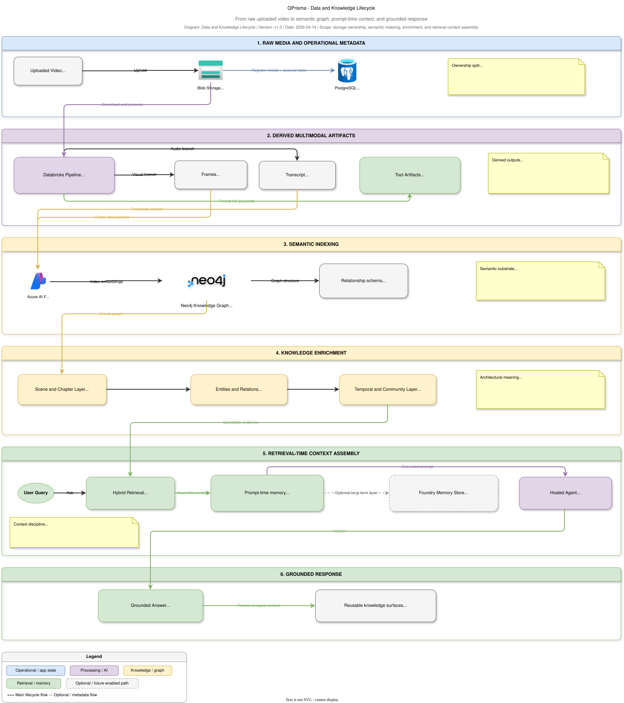

# QPrisma Data and Knowledge Architecture

This document explains how QPrisma turns raw media into structured knowledge and later reuses that knowledge for grounded retrieval.

## Scope

This view focuses on:

- data stores and their responsibilities
- lifecycle from raw media to derived knowledge
- graph and embedding model
- logical lineage across ingestion and retrieval
- storage boundaries and ownership concerns

## Related artifacts

- Published diagram asset: `docs/assets/architecture/qprisma-data-knowledge-lifecycle.svg`
- Ingestion flow: `docs/VIDEO_INGESTION_ARCHITECTURE.md`
- Retrieval flow: `docs/HOSTED_AGENT_RETRIEVAL_ARCHITECTURE.md`
- Platform deployment: `docs/INFRASTRUCTURE.md`
- Deep technical reference: `docs/ARCHITECTURE.md`

## Data architecture summary

QPrisma is not built around a single database. It uses multiple stores because different kinds of data have different access patterns and lifecycle requirements.

## Store responsibility model

| Store / service | Primary role | Typical data |
|---|---|---|
| Azure Blob Storage | Durable object store for raw and large derived artifacts | Uploaded video, large payload artifacts |
| PostgreSQL | Relational system state and metadata | Media metadata, processing state, user/application state, artifact metadata |
| Redis | Queueing, hot cache, pub/sub, transient acceleration | Celery broker data, cached results, event propagation |
| Neo4j | Semantic graph and vector-enabled retrieval structure | Video hierarchy, entities, topics, communities, relationships, embeddings |
| Azure AI Foundry Memory Store | Available long-term semantic memory capability | User-scoped memory items when configured and used |

## 1. Lifecycle from raw media to grounded answer

The QPrisma data lifecycle can be described in six layers.

### Layer 1: Raw media

The raw uploaded asset is stored in Azure Blob Storage. This is the durable source for the original binary payload.

Why it matters:

- the original file remains separate from derived knowledge
- reprocessing does not require the user to upload the asset again
- object storage is a better fit than relational storage for large media payloads

### Layer 2: Operational metadata

PostgreSQL tracks the lifecycle of the media asset in application terms:

- who owns it
- what state it is in
- whether processing is queued, running, or completed
- which application records are associated with it

This is the business-operational truth of the workload.

### Layer 3: Derived multimodal artifacts

During processing, the system creates derived outputs such as:

- frame samples
- transcript segments
- summaries
- extracted entities
- intermediate tool artifacts and processing outputs

These outputs are not all stored in the same place because they do not all have the same usage pattern.

## 2. Semantic indexing strategy

QPrisma prepares content for retrieval during ingestion, not only at query time.

### Embeddings

Embeddings are generated through Azure OpenAI and used to support semantic recall.

Architecturally, the important point is not only that embeddings exist, but that they are generated as part of the ingestion pipeline so later retrieval is cheaper and faster.

### Graph-first semantic structure

Neo4j stores the semantic shape of the media asset rather than a flat list of chunks.

The hierarchy includes:

- Video
- Chapter
- Scene
- Frame
- Entity
- AudioSegment
- Topic
- Community

This hierarchy gives QPrisma multiple levels of retrieval granularity, from coarse summarization to fine-grained evidence.

## 3. Knowledge graph architecture

QPrisma should be described as a **logical multi-tenant graph** rather than as a separate graph database per video.

The repo uses one managed Neo4j deployment and enforces logical separation through data modeling and query filtering.

### Why that matters

- operationally simpler than per-video graph instances
- still supports user- and video-aware isolation
- enables cross-video relationships such as entity resolution

### Knowledge constructs captured in the graph

The graph is used to represent more than adjacency:

- structural containment
- topic assignment
- entity co-occurrence
- semantic relations
- temporal adjacency
- community groupings
- cross-video same-entity links

This makes Neo4j a retrieval substrate, not just a reporting store.

## 4. Data lineage across ingestion and retrieval

The most important data-architecture story in QPrisma is lineage:

1. raw media enters Blob Storage
2. metadata is registered in PostgreSQL
3. worker processing generates derived multimodal artifacts
4. embeddings and structured semantic nodes are created
5. Neo4j stores graph structure plus retrieval-oriented vectors
6. hosted-agent retrieval reads the semantic representation instead of the raw asset
7. the final answer is grounded in scene, entity, transcript, and graph evidence

That is why the platform should be presented as a **knowledge construction system** rather than a simple media uploader with chat on top.

## 5. Relationship between ingestion and retrieval

In many AI workloads, ingestion and retrieval are documented separately and treated as different systems. In QPrisma, they are tightly linked.

### Ingestion is responsible for retrieval quality

If ingestion quality degrades, the hosted agent suffers in:

- evidence recall
- relationship discovery
- timestamp accuracy
- chapter/scene quality
- cross-video reasoning

### Retrieval is responsible for operational value

If retrieval quality degrades, the knowledge graph becomes an expensive indexing exercise with limited business value.

The architectural value emerges only when these two views are documented together.

## 6. Caching and transient knowledge layers

Redis plays an important role in reducing repeated work and improving responsiveness.

Examples include:

- search-result caching
- transient orchestration state
- pub/sub signaling
- queue semantics for background work

This is not the long-term source of truth. It is the short-latency acceleration layer.

## 7. Memory and artifacts as knowledge surfaces

QPrisma also maintains lighter-weight knowledge surfaces outside the main graph:

- graph-state compact memory summaries (`memory_context`)
- persisted tool artifacts and references (`artifact_refs`)
- optional long-term semantic memory through Azure AI Foundry Memory Store

This is architecturally useful because not every form of reusable knowledge belongs in the primary graph.

## 8. Governance and ownership boundaries

A professional data architecture document should always show which layer owns which truth.

### Practical ownership model in QPrisma

| Truth type | System of record |
|---|---|
| Raw uploaded binary | Azure Blob Storage |
| Processing/application metadata | PostgreSQL |
| Queue, transient cache, event fanout | Redis |
| Semantic graph and retrieval structure | Neo4j |
| Optional long-term semantic memory capability | Azure AI Foundry Memory Store |

## 9. Key design strengths

- Purpose-fit persistence instead of forcing one datastore to do everything
- Hierarchical graph model aligned to the media domain
- Retrieval-ready indexing performed during ingestion
- Logical separation of operational metadata from semantic knowledge
- Reusable graph for both single-video and multi-video reasoning

## 10. Key trade-offs

| Trade-off | Benefit | Cost |
|---|---|---|
| Polyglot persistence | Better fit for each workload type | More operational complexity |
| Graph plus embeddings | Better semantic precision and relationship reasoning | More indexing and tuning work |
| Rich derived assets | Better downstream grounding | Longer ingestion and more storage use |
| Cross-video links | Higher analytical value | Stronger governance and identity filtering needed |

## How to present this professionally

For a Solution Architect presentation, describe QPrisma data architecture in this sequence:

1. **raw media durability**
2. **operational metadata**
3. **derived multimodal artifacts**
4. **semantic indexing**
5. **knowledge graph**
6. **retrieval-time grounding**

That sequence shows that the system is designed to transform data into reusable knowledge rather than merely storing video and transcripts.
