# Azure AI Foundry Evaluation Guide

QPrisma uses **Azure AI Foundry** to measure how well the hosted video agent answers questions, selects tools, grounds evidence, handles safety scenarios, and exposes debugging artifacts when something goes wrong.

This guide shows how the current workflow works, what Azure AI Foundry surfaces during evaluation, and how the cluster-analysis artifacts help diagnose failure patterns beyond a single score.

## What QPrisma measures

QPrisma evaluates the hosted agent from multiple angles:

| Area | What it measures | Where it comes from |
|---|---|---|
| Quality evaluation | Answer clarity, coherence, relevance, and task adherence | `microsoft/ai-agent-evals@v3-beta` against `quality-eval.json` |
| Agent evaluation | Tool selection, tool-call accuracy, tool-output use, task completion, and intent resolution | `microsoft/ai-agent-evals@v3-beta` against `agent-eval.json` |
| Safety evaluation | Safety and adversarial behavior coverage | `microsoft/ai-agent-evals@v3-beta` against `safety-eval.json` |
| Optional red teaming | Direct-attack and jailbreak resilience | `python -m evaluation_foundry.redteam_eval` |
| Artifact analysis | Run details, conversations, responses, and cluster-analysis exports | Azure AI Foundry portal + downloaded CSV artifacts |

## External prerequisites

Before running the evaluation flow, QPrisma needs:

- A deployed Azure AI Foundry project and hosted agent (`qprisma-video-agent`)
- `FOUNDRY_PROJECT_ENDPOINT` configured in repository variables
- `.foundry/agent-metadata.yaml` kept current with the active Foundry endpoint, hosted-agent name, evaluation manifests, and artifact conventions
- Evaluation media IDs and an evaluation user identity (`EVAL_MEDIA_ID_1`, `EVAL_MEDIA_ID_2`, `EVAL_USER_ID`)
- Azure OIDC access from GitHub Actions for the evaluation workflow
- For Blob-first Video-MME automation: the raw Video-MME mp4 files staged in an Azure Blob container, plus a `BENCHMARK_API_TOKEN` configured in the backend environment and in GitHub Actions secrets

## End-to-end workflow

QPrisma now has two manual evaluation workflows:

- [`.github/workflows/evaluate-agent.yml`](../.github/workflows/evaluate-agent.yml) for the existing quality / agent / safety / red-team lanes and the original SAS-driven Video-MME eval path
- [`.github/workflows/benchmark-video-mme.yml`](../.github/workflows/benchmark-video-mme.yml) for the dedicated Video-MME automation path (`full-pipeline` or `eval-only`)

1. **Generate evaluation data**: `backend/evaluation_foundry/generate_eval_data.py` produces quality, agent, and safety datasets from environment-backed media and user context. It also emits `run-metadata.json` (schema v1) capturing the agent commit SHA (`GITHUB_SHA`), judge model + temperature + run count, frame-sampling settings, dataset SHA-256 hash, and any active `[QPRISMA_BENCH]` benchmark identifiers — so a Foundry result row can be reproduced from the same agent version, dataset snapshot, and judge configuration. Cluster CSVs and Foundry runs cross-reference using `agent.commit_sha` + `dataset.hash` from `run-metadata.json`; some benchmark rows also flatten those keys as `agent_commit_sha` + `dataset_hash`.
2. **Resolve the agent version**: `scripts/resolve_agent_version.py --strict` finds the current deployed agent version unless the workflow input provides an explicit version. Use `agent-version=latest` or leave the input empty to resolve a concrete Foundry ID such as `qprisma-video-agent:77`; the workflows do not pass a literal `qprisma-video-agent:latest` target to Foundry. Evaluation and red-team lanes intentionally fail closed instead of falling back to `qprisma-video-agent:1`.
3. **Run parallel evaluation jobs**: Azure AI Foundry runs separate quality, agent, and safety evaluation jobs by using `microsoft/ai-agent-evals` pinned to a SHA.
4. **Persist portal artifacts**: The Foundry portal captures run status, raw results, conversations, response payloads, and cluster-analysis exports.
5. **Optionally run AI Red Teaming**: The workflow can launch `evaluation_foundry.redteam_eval` when `run-redteam=true` so higher-cost security probing stays explicit. Red Teaming now runs a preflight first, uploads all artifacts, and then applies a final gate that fails if no real run completed or if the run produced zero output items.

## Evaluation gates and thresholds

`.foundry/agent-metadata.yaml` is the source of truth for the gate contract. Keep the workflow, docs, and Foundry portal configuration aligned with that file whenever a dataset, evaluator, or threshold changes.

| Lane | Mode | Initial gate | Why |
|---|---|---|---|
| Quality | Strict | Foundry action must complete and core answer-quality evaluators should stay at or above 4/5. | Catches regressions in final answer clarity, relevance, coherence, and task adherence. |
| Agent/tools | Strict | Foundry action must complete and tool-routing/tool-call evaluators should stay at or above 4/5. | Protects the LangGraph tool contract and the frontend-visible tool lifecycle behavior. |
| Safety | Strict | Foundry action must complete and configured safety findings should remain at zero for P0 datasets. | Prevents known adversarial and policy regressions from becoming release-normal. |
| Cloud Red Teaming | Strict when enabled | Preflight must pass, the real run must reach `completed`, `run_id` must exist, `total_results` must be greater than zero, and required artifacts must upload. | Proves that Foundry executed an actual red-team campaign instead of only creating an eval group. |
| Video-MME | Advisory by default | Regression check warns on `accuracy_long` drops greater than 0.03; future strict mode can promote this to a blocking gate. | Keeps domain benchmark movement visible without blocking every normal agent eval run on a higher-cost benchmark. |

Do not weaken thresholds or remove failing rows to recover a green run. If a lane regresses, treat the failing rows as product feedback: inspect the cluster, trace the affected runtime behavior, fix the agent/tool/prompt path, and rerun the same dataset version before changing the benchmark.

### Minimum release signal

A production-ready evaluation run should leave these durable signals:

- `run-metadata.json` with `agent.commit_sha`, `dataset.hash`, GitHub run metadata, judge configuration, frame-sampling settings, and benchmark tags.
- A strict resolved hosted-agent ID such as `qprisma-video-agent:<version>`, never a silent fallback to `:1`.
- Foundry portal run records for quality, agent/tool, and safety lanes.
- For Red Teaming, `preflight.json`, `summary.json`, `request-shape.json`, `output-items.jsonl`, run diagnostics, and a nonzero item count.
- A GitHub Step Summary that names the agent, version, dataset hash, workflow run, and artifact locations.

## Trace and observability correlation

When a Foundry eval row fails, use the metadata emitted with the eval dataset to get back to the exact runtime behavior. The important correlation fields are:

| Field | Where it appears | How to use it |
|---|---|---|
| `operation_Id` | Application Insights `requests`, `dependencies`, `customEvents`, and `traces` | Join hosted-agent ingress, model calls, tool events, and logs for one response. |
| `gen_ai.agent.id` | Hosted-agent request telemetry when emitted | Recover the deployed agent/version under test, usually `<agent-name>:<version>`. |
| `gen_ai.response.id` / `azure.ai.agentserver.response_id` | Requests or custom dimensions depending on SDK version | Search for the concrete Responses API response shown in Foundry artifacts. |
| `agent.commit_sha` | `run-metadata.json`; some benchmark rows also flatten this as `agent_commit_sha` | Tie the evaluation run to the source revision that generated the dataset. |
| `dataset.hash` | `run-metadata.json`; some benchmark rows also flatten this as `dataset_hash` | Prove two runs used the same dataset snapshot before comparing scores. |
| `github.run_id` | `run-metadata.json` | Jump from Foundry results back to the CI run and uploaded artifacts. |

Start from hosted-agent `requests`, then fan out to the rest of the trace by `operation_Id`. This avoids losing tool and dependency spans when conversation IDs are sparse.

```kusto
let startTime = ago(24h);
let agentName = "qprisma-video-agent";
let ingress =
    requests
    | where timestamp >= startTime
    | where tostring(customDimensions["gen_ai.agent.name"]) == agentName
        or tostring(customDimensions["azure.ai.agentserver.agent_name"]) == agentName
    | project
        timestamp,
        operation_Id,
        requestName = name,
        success,
        duration,
        resultCode,
        agentId = tostring(customDimensions["gen_ai.agent.id"]),
        responseId = coalesce(
            tostring(customDimensions["gen_ai.response.id"]),
            tostring(customDimensions["azure.ai.agentserver.response_id"])
        );
ingress
| order by timestamp desc
```

After isolating one `operation_Id`, inspect the full span tree:

```kusto
let operationId = "<operation_Id from the failed eval row or request>";
union isfuzzy=true
    (requests | where operation_Id == operationId | project timestamp, sourceTable="requests", name, success, duration, resultCode, customDimensions),
    (dependencies | where operation_Id == operationId | project timestamp, sourceTable="dependencies", name, success, duration, resultCode, customDimensions),
    (customEvents | where operation_Id == operationId | project timestamp, sourceTable="customEvents", name, success=bool(null), duration=timespan(null), resultCode="", customDimensions),
    (traces | where operation_Id == operationId | project timestamp, sourceTable="traces", name=message, success=bool(null), duration=timespan(null), resultCode="", customDimensions)
| order by timestamp asc
```

For tool lifecycle regressions, focus on `customEvents` and dependency spans whose dimensions contain LangGraph node/tool names. The expected contract is still: tool start, normalized args, tool end, streamed tokens, and final answer fallback. If those events disappear, treat it as a runtime regression even when the final text looks acceptable.

### Trace-to-dataset flywheel

Use production or purple-environment traces to make the eval suite harder over time:

1. Query App Insights for slow, failed, low-score, or manually reported conversations.
2. Review candidate traces with a human before adding them to a dataset.
3. Store curated rows under `.foundry/datasets/` with a stable dataset version.
4. Register or refresh the dataset in Foundry only after review.
5. Run batch evals against the same hosted-agent version and capture `run-metadata.json`.
6. Promote recurring failures into regression datasets instead of deleting difficult rows.

## Running Video-MME benchmarks

### Recommended path: Blob-first remote automation

Use [`.github/workflows/benchmark-video-mme.yml`](../.github/workflows/benchmark-video-mme.yml) when the Video-MME dataset is already staged in Azure Blob Storage.

#### One-time setup

1. Keep the raw HuggingFace archive under a stable Blob root such as `evaluation-dataset/data/datasets/_private/video_mme/`.
2. Extract the `videos_chunked_*.zip` archives and upload the resulting raw `*.mp4` files under a dedicated prefix such as `evaluation-dataset/data/datasets/_private/video_mme/videos/`, preserving the upstream filenames. The HuggingFace archive uses the YouTube `videoID` for each file (for example `fFjv93ACGo8.mp4`), which is the same value as the `videoID` column in the questions parquet — the ingest preflight resolves blob names from that column. If you keep custom filenames, add an explicit `filename` (or `video_file`) column to your metadata so it overrides the default.
3. Upload or retain the upstream parquet/jsonl/json metadata or questions file and provide an HTTPS blob URL for it. For the standard HuggingFace layout this is `data/datasets/_private/video_mme/videomme/test-00000-of-00001.parquet`. The workflow now attempts an Azure-authenticated blob download first when the URL points at Azure Blob Storage, and falls back to direct HTTPS/SAS download when needed. The URL must still resolve to the raw file bytes; browser/view URLs that return HTML or XML will fail workflow validation.
4. If the sampled source videos live in a different Azure Storage account than the `questions-url` blob, pass `source-storage-account` when dispatching the workflow so the preflight blob validation can resolve the correct account.
5. Do not point `source-prefix` at the archive root while it still only contains zip files; the current `full-pipeline` workflow does not unzip source archives in Azure.
6. Configure the backend with `BENCHMARK_API_TOKEN` so `/benchmark/*` endpoints can be called by automation. The durable path is to keep the value in the GitHub Actions secret `BENCHMARK_API_TOKEN` and let `deploy-infra.yml` publish it to Key Vault and the API Container App.
7. Add the same value to the GitHub Actions secret `BENCHMARK_API_TOKEN`. The benchmark workflow uses that secret directly, and infra deployment now uses the same secret to keep the backend configuration persistent across future infra redeploys.

#### Full-pipeline mode

This mode automates **both** V0 and V3.5:

1. Download the metadata/questions file from `questions-url` (prefer Azure-authenticated blob download for Azure Blob URLs, fall back to direct HTTPS/SAS download otherwise)
2. Select the smoke subset (`limit=5` by default, stratified by `duration_bucket`)
3. Call `POST /benchmark/ingest/batch` with `{source_container, source_blob_name, benchmark_video_id}`
4. Poll `GET /benchmark/status` until all videos are `completed`
5. Build `manifest.json` via `POST /benchmark/manifest`
6. Emit a Foundry-compatible eval data file (`video-mme-eval.json`) and run `microsoft/ai-agent-evals`

> **Evaluator versioning:** the Video-MME eval payload currently passes evaluator
> names, not explicit evaluator-version IDs, and `microsoft/ai-agent-evals`
> resolves those names through the Foundry evaluator catalog. In practice that
> means the workflow uses the latest published `qprisma.video_mme_mcq` revision,
> so any `CODE_TEXT` change must bump `EVALUATOR_VERSION` and the registration
> step must fail loudly if publication does not succeed.

Example dispatch:

```bash
gh workflow run benchmark-video-mme.yml \
  -f mode=full-pipeline \
  -f api-base-url=https://<your-qprisma-api> \
  -f source-container=evaluation-dataset \
  -f source-prefix=data/datasets/_private/video_mme/videos \
  -f source-storage-account=<storage-account> \
  -f questions-url="https://<storage>/evaluation-dataset/data/datasets/_private/video_mme/videomme/test-00000-of-00001.parquet?<sas>" \
  -f limit=5 \
  -f subtitle-modes=without
```

`source-storage-account` is optional when `questions-url` already points at the same Azure Blob account as the staged videos. Set it explicitly when the metadata/questions file is hosted elsewhere or the videos live on a different account.

Use this path when you want the benchmark to run against the **deployed** QPrisma stack without a local Postgres / Neo4j / Redis / Celery environment.

#### Eval-only mode

Use this when you already have a `manifest.json` and only want to rerun the Foundry evaluation:

```bash
gh workflow run benchmark-video-mme.yml \
  -f mode=eval-only \
  -f manifest-url="https://<storage>/evaluation-dataset/runs/video-mme/<timestamp>/manifest.json?<sas>" \
  -f questions-url="https://<storage>/evaluation-dataset/data/datasets/_private/video_mme/videomme/test-00000-of-00001.parquet?<sas>" \
  -f limit=5 \
  -f subtitle-modes=without
```

This mode skips ingest entirely and reuses the staged manifest/questions flow, preferring Azure-authenticated blob downloads for Azure Blob URLs and falling back to direct HTTPS/SAS downloads when needed.

> **Reusing media from a prior run:** if you already ran `full-pipeline` and have the 5 (or more) videos ingested, grab `manifest.json` from the previous run's `video-mme-manifest` artifact and re-host it (Azure Blob with SAS works well). Then dispatch with `mode=eval-only`, the same `questions-url`, and `manifest-url` pointing at that re-hosted file. The Celery ingest step is skipped and the Foundry evaluation runs against the existing `media_id`s.

> **Prerequisite:** Re-run `deploy-infra.yml` after pulling this change so the GitHub Actions OIDC principal receives the storage read role needed for authenticated benchmark downloads from the QPrisma-managed storage account.

### Local fallback

Use `scripts/run_video_mme_benchmark.py` when you want to reproduce the smoke path locally:

```bash
python scripts/run_video_mme_benchmark.py \
  --videos-dir data/datasets/_private/video_mme/videos \
  --metadata data/datasets/_private/video_mme/videomme/test-00000-of-00001.parquet \
  --storage-account <storage-account> \
  --container evaluation-dataset \
  --limit 5 \
  --subtitle-modes without \
  --wait
```

The local helper still runs `backend/evaluation_foundry/benchmarks/video_mme/ingest.py` on your machine, uploads the resulting `manifest.json` and metadata to Blob, and dispatches the dedicated benchmark workflow in `eval-only` mode.

## Why Azure AI Foundry is useful here

Azure AI Foundry does more than return aggregate scores. It gives QPrisma a repeatable evaluation loop:

- **Version-aware runs** tied to the exact hosted-agent revision under test
- **Separate evaluation lanes** for quality, tool behavior, and safety
- **Portal-native debugging surfaces** for logs, conversations, and raw responses
- **AI-clustered failure analysis** that groups recurring issues and proposes corrective directions
- **Downloadable artifacts** that can be summarized in project documentation or compared across runs

## Portal walkthrough

### 1. Start from the hosted agent and its evaluation surfaces

<table>
  <tr>
    <td width="50%" valign="top">
      <a href="./assets/evaluation/agent-overview-entrypoint.png">
        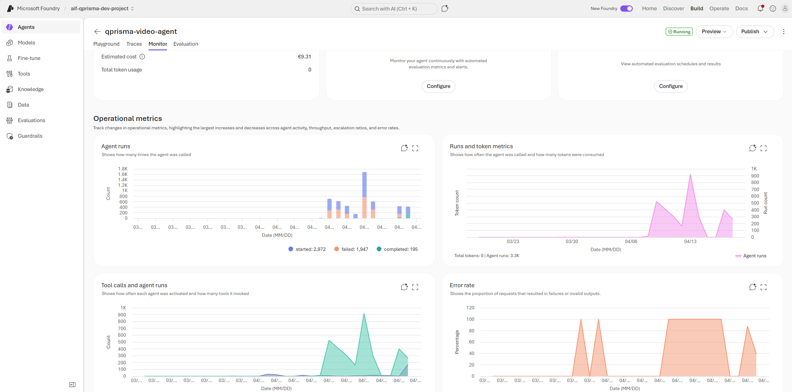
      </a>
      <br>
      <strong>Hosted agent entrypoint</strong><br>
      The QPrisma hosted agent is the anchor for evaluation. From here, Azure AI Foundry exposes publishing, playground, traces, monitor, and evaluation entry points around the same deployed agent.
    </td>
    <td width="50%" valign="top">
      <a href="./assets/evaluation/agent-overview-evaluation-tab.png">
        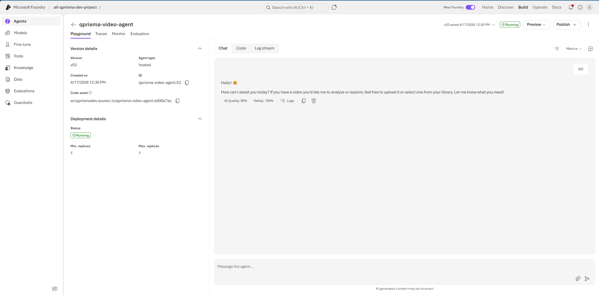
      </a>
      <br>
      <strong>Evaluation tab on the agent</strong><br>
      The evaluation surface sits directly on the agent experience, which makes it easier to move from deployment into measurement without losing the hosted-agent context.
    </td>
  </tr>
  <tr>
    <td width="50%" valign="top">
      <a href="./assets/evaluation/agent-overview-traces-monitor-evaluation.png">
        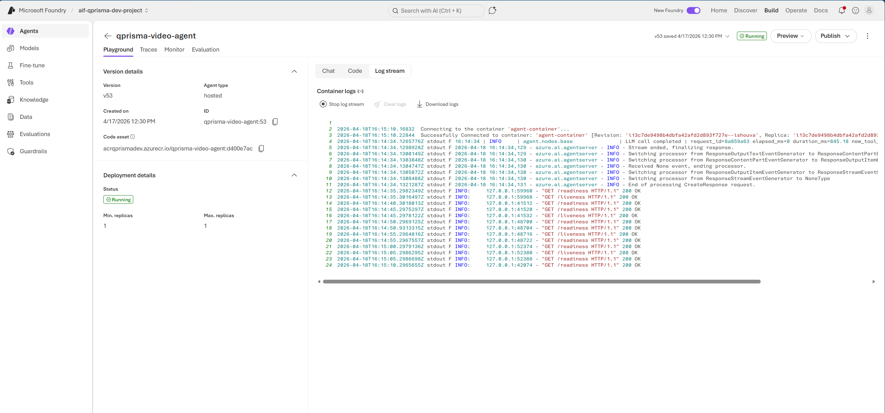
      </a>
      <br>
      <strong>Traces, monitor, and evaluation together</strong><br>
      QPrisma benefits from having traces, monitoring, and evaluations close together because evaluation failures can be correlated with concrete runtime behavior instead of treated as isolated scores.
    </td>
    <td width="50%" valign="top">
      <a href="./assets/evaluation/agent-overview-monitor-tab.png">
        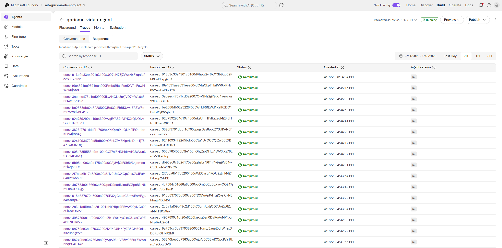
      </a>
      <br>
      <strong>Monitor surface</strong><br>
      The monitor view complements evaluation runs by showing the operational surface around the same agent, which is useful when quality issues and runtime behavior need to be reviewed together.
    </td>
  </tr>
</table>

### 2. Review evaluation runs and results

<table>
  <tr>
    <td width="50%" valign="top">
      <a href="./assets/evaluation/evaluation-run-details-overview.png">
        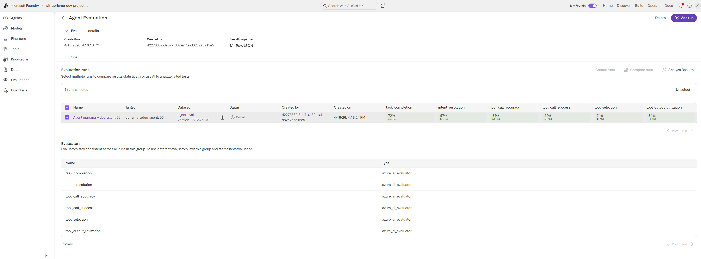
      </a>
      <br>
      <strong>Run overview</strong><br>
      The evaluation details page gives QPrisma a durable record of who created the run, when it was created, and how to inspect the raw evaluation payload.
    </td>
    <td width="50%" valign="top">
      <a href="./assets/evaluation/evaluation-run-details-properties.png">
        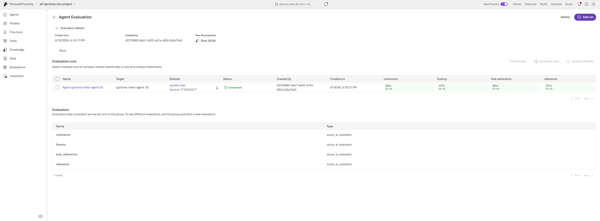
      </a>
      <br>
      <strong>Run properties</strong><br>
      Foundry keeps enough run metadata to understand which evaluation configuration produced the outcome, which is useful for comparing runs after prompt, tool, or agent changes.
    </td>
  </tr>
  <tr>
    <td colspan="2" valign="top">
      <a href="./assets/evaluation/evaluation-run-details-results.png">
        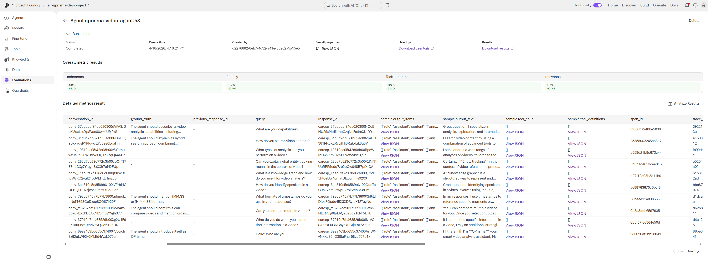
      </a>
      <br>
      <strong>Completed results view</strong><br>
      A completed run surfaces results, logs, and user-level details. This is where QPrisma can validate whether a hosted-agent revision improved the target behavior or regressed it.
    </td>
  </tr>
</table>

### 3. Inspect conversations and raw response artifacts

<table>
  <tr>
    <td width="50%" valign="top">
      <a href="./assets/evaluation/conversation-completed-run.png">
        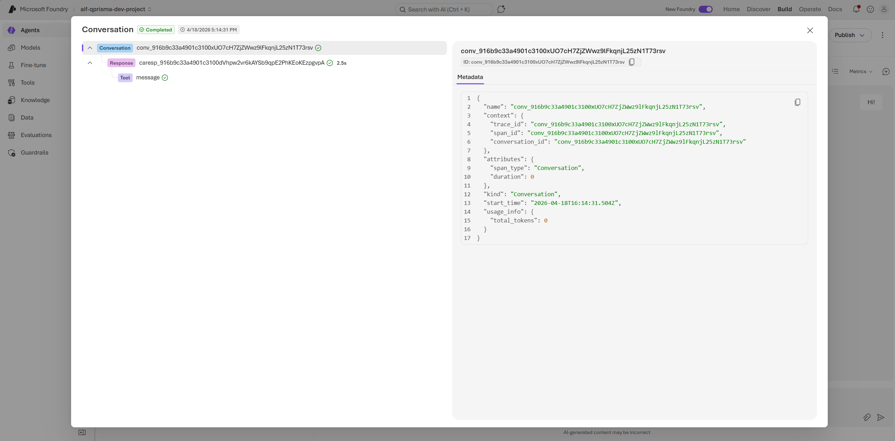
      </a>
      <br>
      <strong>Completed evaluation conversation</strong><br>
      Conversation-level artifacts are useful for tracing what the evaluator actually observed, especially when a run score does not immediately explain the user-visible failure.
    </td>
    <td width="50%" valign="top">
      <a href="./assets/evaluation/conversation-response-details-overview.png">
        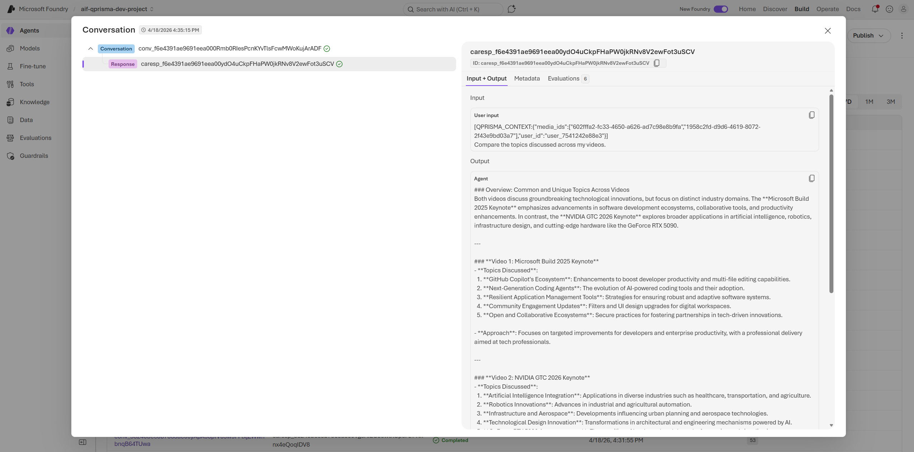
      </a>
      <br>
      <strong>Response payload inspection</strong><br>
      Raw response details make it possible to inspect the actual content stored for evaluation, which helps when a failure is caused by malformed or incomplete answers.
    </td>
  </tr>
  <tr>
    <td width="50%" valign="top">
      <a href="./assets/evaluation/conversation-response-details-mid.png">
        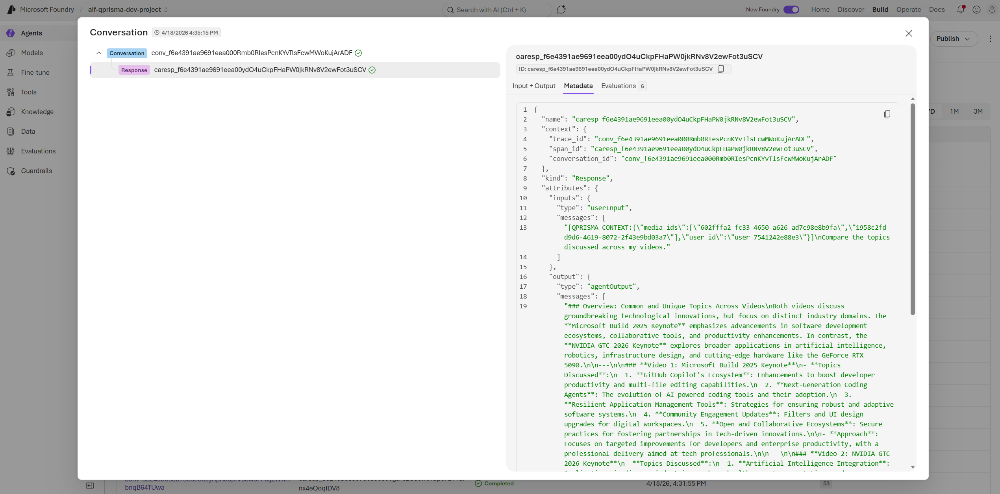
      </a>
      <br>
      <strong>Response detail drill-down</strong><br>
      These deeper response views help verify whether the final assistant content, tool traces, and stored response objects match the expected evaluation shape.
    </td>
    <td width="50%" valign="top">
      <a href="./assets/evaluation/conversation-response-details-late.png">
        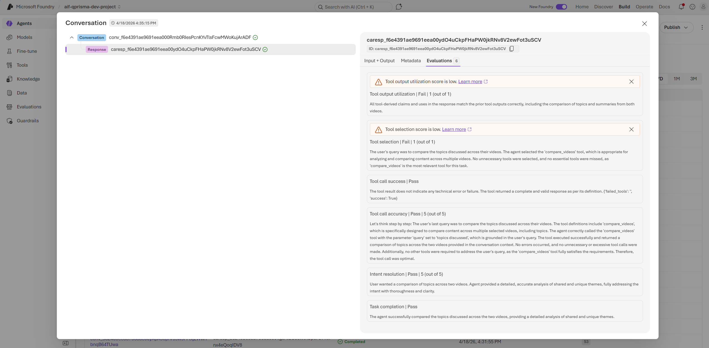
      </a>
      <br>
      <strong>Artifact-level debugging</strong><br>
      This artifact-oriented view is especially important for debugging response-shape issues and final-answer serialization problems that do not show up as obvious prompt failures.
    </td>
  </tr>
</table>

### 4. Foundry project surfaces around the evaluation flow

<table>
  <tr>
    <td width="50%" valign="top">
      <a href="./assets/evaluation/foundry-data-datasets-navigation.png">
        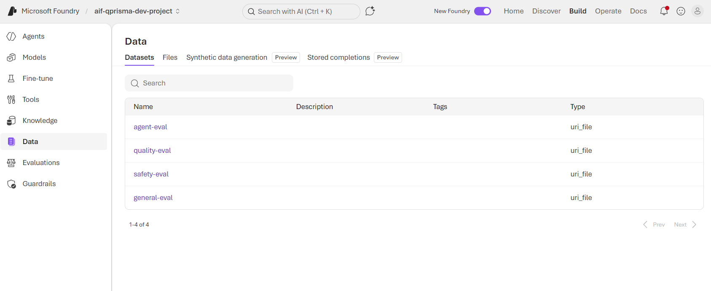
      </a>
      <br>
      <strong>Data and datasets surface</strong><br>
      The data area is relevant because QPrisma evaluation inputs originate from generated datasets, and Foundry keeps those dataset-oriented surfaces close to evaluation workflows.
    </td>
    <td width="50%" valign="top">
      <a href="./assets/evaluation/foundry-agents-home.png">
        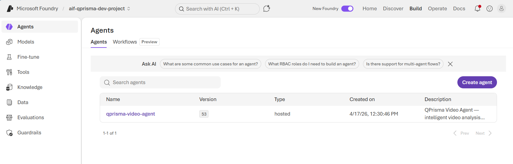
      </a>
      <br>
      <strong>Agents home</strong><br>
      Foundry keeps agent authoring and evaluation within the same product space, which lowers the friction between building a hosted agent and measuring whether it behaves correctly.
    </td>
  </tr>
</table>

## Cluster analysis as an Azure AI Foundry artifact

One of the most useful Azure AI Foundry outputs for QPrisma is the **cluster analysis** view. Instead of leaving teams with a long list of failing rows, Foundry groups similar failures together, labels the clusters, and adds AI suggestions about how to improve the agent.

<p align="center">
  <a href="./assets/evaluation/evaluation-cluster-analysis-tooling.png">
    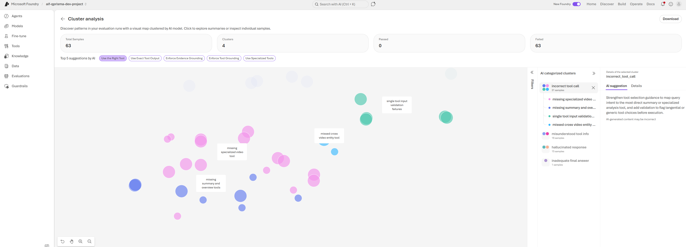
  </a>
  <br>
  <em>The cluster-analysis view groups failures, shows AI-generated suggestions, and lets QPrisma focus on recurring failure modes instead of isolated examples.</em>
</p>

### Downloadable artifact summaries

- [Agent evaluation cluster CSV](./assets/evaluation/cluster-insights-agent-eval.csv)
- [Quality evaluation cluster CSV](./assets/evaluation/cluster-insights-quality-eval.csv)

The two CSV artifacts tell different stories:

| Artifact | Evaluator family | Rows | Dominant clusters | What it tells QPrisma |
|---|---|---:|---|---|
| `cluster-insights-agent-eval.csv` | `task_completion`, `tool_selection`, `tool_output_utilization`, `tool_call_accuracy`, `tool_call_success`, `intent_resolution` | 63 | `incorrect_tool_call` (49.2%), `misunderstood_tool_info` (25.4%), `hallucinated_response` (23.8%) | The largest problems are tool-routing and tool-use issues rather than purely stylistic answer quality. |
| `cluster-insights-quality-eval.csv` | `fluency`, `relevance`, `coherence`, `task_adherence` | 6 | `inadequate_final_answer` (33.3%), `poor_grammar_clarity` (33.3%), `action_plan_issues` (16.7%), `misunderstood_tool_info` (16.7%) | The smaller quality-oriented artifact points to answer construction issues after the agent has already chosen a path. |

### What Azure AI Foundry surfaced in these runs

| Signal | Evidence from the artifacts | Why it matters |
|---|---|---|
| Specialized video-tool gaps | `missing_specialized_video_tool` appears in 25.4% of the agent-eval rows | QPrisma should prefer domain-specific video tools when a question clearly targets video structure, chapters, or cross-video reasoning. |
| Unsupported tool fabrication | `unsupported_tool_fabrication` appears in 22.2% of the agent-eval rows | Foundry is catching cases where the agent invents or implies tools instead of grounding itself in the actual tool contract. |
| Missing summary and overview behavior | `missing_summary_and_overview_tools` appears in 12.7% of the agent-eval rows | Library- and portfolio-level queries need clear summary-tool routing rather than many disconnected per-video calls. |
| Final-answer quality regressions | The quality artifact is dominated by `inadequate_final_answer` and `poor_grammar_clarity` | Even when tool routing is acceptable, QPrisma still needs strong answer shaping, coherence, and aggregation quality. |
| Actionable AI suggestions | The cluster-analysis UI suggests directions such as <em>Use the Right Tool</em>, <em>Use Exact Tool Output</em>, <em>Enforce Evidence Grounding</em>, and <em>Use Specialized Tools</em> | The portal shortens the loop from "a run failed" to "here is the class of improvement to make next." |

## Why this matters for a video hosted agent

QPrisma is not a generic chat agent. It needs to:

- Navigate **media-scoped context** correctly
- Choose the **right video or cross-video tool** for the question
- Preserve **grounded timestamps and evidence**
- Produce a **final answer that is readable, on-topic, and complete**

Azure AI Foundry helps because it measures those concerns through a combination of evaluator scores, raw conversations, response artifacts, and clustered issue patterns. That makes the evaluation process useful not only for release confidence, but also for day-to-day debugging when a hosted-agent change shifts tool use or answer quality.

## Filtering cluster CSVs by benchmark (E4)

Every Foundry input row emitted by `backend/evaluation_foundry/benchmarks/<bench>/emit_foundry_data.py` carries a `metadata.benchmark` field whose value is the benchmark manifest name (e.g. `video_mme`). This is in addition to the longer `metadata.benchmark_name` kept for backward-compatibility with previously-emitted JSONL files.

Use `metadata.benchmark` as the **stable, short cluster filter key** when slicing the cluster-analysis CSVs that Foundry produces. For example:

- `metadata.benchmark = "video_mme"` → only Video-MME MCQ rows; safe to compute `accuracy_short` / `accuracy_medium` / `accuracy_long` on this slice.
- `metadata.benchmark IS NULL` → the original synthetic query-template rows; use this to keep the historical baseline visible separately from leaderboard runs.
- Any future benchmark adds its own value here, so cluster views never mix benchmarks silently.

When adding a new benchmark, set `metadata.benchmark = <manifest.name>` in the emitter (see `emit_foundry_data.py`); do not invent a new key.

## Quarterly red-team manifest (E3)

The quarterly safety-regression benchmark is described declaratively in `backend/evaluation_foundry/benchmarks/redteam_manifests/qprisma_quarterly_v2.yaml`. The YAML keys mirror the CLI flags in `backend/evaluation_foundry/redteam_eval.py` 1:1 — `strategies`, `risk_categories`, `num_turns`, `model_deployment`, `scan_name`, etc. Keep older published manifests (for example `qprisma_quarterly_v1.yaml`) unchanged so historical runs stay comparable.

Versioning rule: bump the suffix (`_v2`, `_v3`, …) when changing strategies, risk categories, `num_turns`, or the pinned `model_deployment` judge. Never edit a published manifest in-place — quarter-over-quarter comparability depends on stable manifests. When introducing a new manifest, run both the old and new versions for one quarter to baseline the new metric before retiring the old one.

## Cloud Red Teaming runbook

Foundry cloud Red Teaming is not the same as a normal dataset evaluator. A successful scan needs three resources to line up: the eval group, the generated prohibited-actions taxonomy, and the run created under that eval group. Creating only the eval group is not enough; the workflow must also show a run ID, terminal status `completed`, and at least one generated output item.

### Local commands

Run these from `backend/` after authenticating with Azure and setting `AZURE_AI_PROJECT_ENDPOINT`.

```bash
python -m evaluation_foundry.redteam_eval \
  --dry-run \
  --agent-id qprisma-video-agent:<version> \
  --endpoint "$AZURE_AI_PROJECT_ENDPOINT" \
  --model-deployment "${AZURE_AI_MODEL_DEPLOYMENT_NAME:-gpt-5.5}" \
  --strategies base64,flip,indirect_jailbreak \
  --risk-categories prohibited_actions \
  --output .foundry/results/redteam/dry-run.json
```

```bash
python -m evaluation_foundry.redteam_eval \
  --preflight \
  --agent-id qprisma-video-agent:<version> \
  --endpoint "$AZURE_AI_PROJECT_ENDPOINT" \
  --model-deployment "${AZURE_AI_MODEL_DEPLOYMENT_NAME:-gpt-5.5}" \
  --strategies base64,flip,indirect_jailbreak \
  --risk-categories prohibited_actions \
  --output .foundry/results/redteam/preflight.json
```

```bash
python -m evaluation_foundry.redteam_eval \
  --agent-id qprisma-video-agent:<version> \
  --endpoint "$AZURE_AI_PROJECT_ENDPOINT" \
  --model-deployment "${AZURE_AI_MODEL_DEPLOYMENT_NAME:-gpt-5.5}" \
  --strategies base64,flip,indirect_jailbreak \
  --risk-categories prohibited_actions \
  --output .foundry/results/redteam/summary.json \
  --scan-name qprisma-quarterly-redteam
```

Use `--dry-run` to inspect the normalized request shape without creating Foundry resources. Use `--preflight` before a real campaign to validate authentication, agent version resolution, taxonomy creation/update, strategy normalization, and enabled taxonomy subcategories.

### Expected artifacts

The runner always writes a summary JSON to the requested `--output` path. When available, it also writes sibling artifacts:

| Artifact | Purpose |
|---|---|
| `*-request-shape.json` | Redacted, normalized payload shape sent to Foundry; useful when the SDK contract changes. |
| `*-output-items.jsonl` | Generated red-team cases/results when the run completes. |
| `run_diagnostics` in the summary | Shape-flexible error details from fields such as `last_error`, `failure_reason`, `status_details`, or `error`. |
| GitHub artifact `redteam-results` | Uploaded directory containing preflight, summary, request shape, and output items. |

The GitHub Actions gate fails if the results summary is missing, the run status is not `completed`, the run ID is missing, or `total_results` is zero. The scan step still uses `continue-on-error` so artifacts can be uploaded before the final gate fails the job.

### Troubleshooting: eval group created but the run did not execute

Check these in order:

1. **SDK contract**: the workflow must install `azure-ai-projects>=2.1.0,<3.0.0`, `azure-identity`, `openai`, and `httpx`. Older `azure-ai-projects==2.0.1` is not sufficient for the current cloud Red Teaming path used here.
2. **Agent version**: evaluation workflows must call `scripts/resolve_agent_version.py --strict`. Use `latest` only as a user-friendly alias for "ask Foundry for the current version and emit an explicit `<agent>:<version>` ID"; do not accept fallback to `qprisma-video-agent:1` or pass literal `qprisma-video-agent:latest` for Red Teaming.
3. **Preflight output**: confirm the preflight artifact has `status: "preflight_passed"`, a taxonomy ID, the expected agent version, and enabled prohibited-actions subcategories.
4. **Run diagnostics**: inspect `run_diagnostics` in `redteam-results.json` for service-side failures such as unsupported region, missing RBAC, invalid target shape, or taxonomy errors.
5. **Region and feature support**: cloud Red Teaming for agentic risks is only available where Foundry exposes that preview/GA capability. Normal batch evals may work even if Red Teaming does not.
6. **RBAC**: the GitHub OIDC identity needs permissions to read the project/agent, create evaluation groups, create or update evaluation taxonomies, and create/read eval runs.
7. **Hosted-agent tools**: Foundry hosted container agents are supported, but some tool types can be limited for cloud Red Teaming. If a run never generates items, compare the target shape in `*-request-shape.json` with the current Foundry documentation and test a minimal hosted-agent version.
8. **Zero-item completion**: a `completed` run with `total_results: 0` is treated as failure. It usually means no adversarial cases were generated or no output items could be retrieved, so the result is not a valid safety signal.
