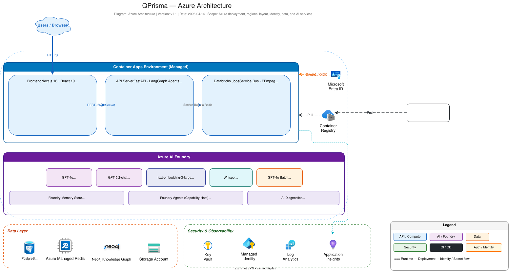

# QPrisma Infrastructure & CI/CD Documentation

This document provides a comprehensive deep-dive into QPrisma's infrastructure architecture, CI/CD pipelines, and Azure deployment configuration.

For the full architecture portfolio and the related Solution Architect views, start with `docs/ARCHITECTURE_PORTFOLIO.md`. This document is the platform and deployment reference view within that portfolio.

## Table of Contents

- [Infrastructure Overview](#infrastructure-overview)
- [Azure Resource Architecture](#azure-resource-architecture)
- [CI/CD Pipeline](#cicd-pipeline)
- [Infrastructure as Code (Bicep)](#infrastructure-as-code-bicep)
- [Secrets Management](#secrets-management)
- [Deployment Flow](#deployment-flow)
  - [Entra ID SPA Redirect URI Sync](#entra-id-spa-redirect-uri-sync)
- [Multi-Region Strategy](#multi-region-strategy)
- [Monitoring & Observability](#monitoring--observability)
- [Troubleshooting](#troubleshooting)

---

## Infrastructure Overview

QPrisma runs on **Azure Container Apps** with a microservices architecture. The infrastructure is fully defined as code using **Azure Bicep** and deployed via **GitHub Actions**.

### Related architecture views

- `docs/assets/architecture/azure-architecture.svg` - Azure deployment and regional resource layout
- `docs/SECURITY_IDENTITY_ARCHITECTURE.md` - identity, trust boundaries, and secret flow
- `docs/OPERATIONS_NFRS_ARCHITECTURE.md` - scaling, reliability, observability, and trade-offs



```
┌─────────────────────────────────────────────────────────────────────┐
│                        GitHub Actions CI/CD                         │
│  ci.yml → build-and-push.yml → deploy-infra.yml / deploy-app.yml  │
└────────────────────────────────┬────────────────────────────────────┘
                                 │
┌────────────────────────────────▼────────────────────────────────────┐
│                    Azure Resource Group (rg-qprisma-dev)            │
│                                                                     │
│  ┌──────────────────── VNet (10.0.0.0/16) ─────────────────────┐   │
│  │                  Container Apps Environment                  │   │
│  │                                                              │   │
│  │  ┌─────────────┐  ┌──────────────┐  ┌───────────────────┐  │   │
│  │  │  API (ext)  │  │ Frontend(ext)│  │  Worker (int)     │  │   │
│  │  │  Port 8000  │  │  Port 3000   │  │  Celery + KEDA    │  │   │
│  │  │  0.5C/1Gi   │  │  0.25C/0.5Gi │  │  1C/2Gi           │  │   │
│  │  │  1-2 rep    │  │  1-2 rep     │  │  1-3 rep (scaler) │  │   │
│  │  └──────┬──────┘  └──────┬───────┘  └──────┬────────────┘  │   │
│  │         │                │                  │               │   │
│  │  └──────┴────────────────┴──────────────────┴────────────┘  │   │
│  └──────────────────────────────────────────────────────────────┘   │
│                                                                     │
│  ┌────────────────────────────────────────────────────────────┐     │
│  │  Neo4j Professional (external managed service)            │     │
│  │  neo4j+s://<managed-neo4j-host> (TLS)                     │     │
│  │  URI/user/password/database injected via secrets          │     │
│  └────────────────────────────────────────────────────────────┘     │
│                                                                     │
│  ┌─────────────┐  ┌──────────────┐  ┌────────────────────────┐     │
│  │ PostgreSQL   │  │  Redis       │  │  Azure AI Foundry      │     │
│  │ Flex v16     │  │  Enterprise  │  │  (West Europe)         │     │
│  │ (N. Europe)  │  │  Balanced_B0 │  │  GPT-4o, GPT-5.2-chat │     │
│  │ 32GB         │  │  TLS 1.2+    │  │  Whisper, Embeddings   │     │
│  └─────────────┘  └──────────────┘  └────────────────────────┘     │
│                                                                     │
│  ┌─────────────┐  ┌──────────────┐  ┌────────────────────────┐     │
│  │ Storage     │  │  Container   │  │  Key Vault             │     │
│  │ Account     │  │  Registry    │  │  RBAC + Managed ID     │     │
│  │ (media)     │  │  (Basic)     │  │  Soft delete (7d)      │     │
│  └─────────────┘  └──────────────┘  └────────────────────────┘     │
│                                                                     │
│  ┌────────────────────────────────────────────────────────────┐     │
│  │  Log Analytics Workspace (30-day retention)                │     │
│  └────────────────────────────────────────────────────────────┘     │
└─────────────────────────────────────────────────────────────────────┘
```

---

## Azure Resource Architecture

### Container Apps (Application Tier)

| App | Type | CPU/Memory | Replicas | Scaling | Ingress |
|-----|------|-----------|----------|---------|---------|
| `ca-qprisma-api-{env}` | API Server | 0.5 CPU / 1Gi | 1–2 | HTTP concurrent requests (>10) | External (HTTPS) |
| `ca-qprisma-web-{env}` | Frontend | 0.25 CPU / 0.5Gi | 1–2 | HTTP concurrent requests (>20) | External (HTTPS) |
| `ca-qprisma-worker-{env}` | Celery Worker | 1 CPU / 2Gi | 1–3 | KEDA Redis scaler (queue >5) | None (internal) |

**Key Design Decisions:**
- **Managed Identity**: API, Worker, and Frontend use a shared user-assigned identity for ACR pulls and Key Vault-backed secret resolution; API and Worker keep system-assigned identities for runtime Azure SDK auth
- **KEDA Autoscaling**: Worker scales based on Celery Redis queue depth, with 600s graceful termination
- **Min Replicas = 1**: API and Frontend always have at least 1 replica to avoid cold start latency

### Data Tier

| Service | SKU | Location | Key Config |
|---------|-----|----------|------------|
| PostgreSQL Flexible Server | Standard_B1ms (Burstable) | North Europe | v16, 32GB auto-grow, 7-day backup |
| Azure Managed Redis | Balanced_B0 (Enterprise) | West Europe | TLS 1.2+, port 10000, VolatileLRU eviction |
| Azure Blob Storage | Standard_LRS (Hot) | West Europe | `media` container, CORS, HTTPS-only |
| Neo4j Professional | Managed external service | Azure-hosted deployment | Public `neo4j+s://` endpoint, TLS, URI/user/password/database passed from GitHub secrets |

### AI Tier

| Deployment | Model | SKU | Capacity |
|------------|-------|-----|----------|
| `gpt-4o` | GPT-4o | GlobalStandard | 450K TPM |
| `gpt-5.2-chat` | GPT-5.2-chat | GlobalStandard | 1M TPM |
| `text-embedding-3-large` | text-embedding-3-large | GlobalStandard | 350K TPM |
| `whisper` | Whisper | Standard | 3 RPM |
| `gpt-4o-batch` | GPT-4o (Batch) | GlobalBatch | 200M tokens (conditional) |

### Security Tier

| Service | Config |
|---------|--------|
| Key Vault | Standard SKU, RBAC authorization, soft delete (7-day retention) |
| Container Registry | Basic tier, admin user disabled, ARM-token auth enabled for managed-identity image pulls |
| Managed Identity | Shared runtime UAMI granted "AcrPull" + "Key Vault Secrets User"; API + Worker system identities granted Storage Blob Data Contributor and Azure OpenAI access |

---

## CI/CD Pipeline

QPrisma uses **11 GitHub Actions workflows** that form a connected pipeline for continuous integration, infrastructure provisioning, application deployment, AI model management, and release automation:

```
┌──────────┐     ┌────────────────────┐     ┌──────────────┐
│  ci.yml  │────▶│ build-and-push.yml │────▶│ deploy-app   │
│ (PR/push)│     │ (main push)        │     │ (auto-trigger)│
└──────────┘     └────────────────────┘     └──────────────┘

┌──────────────────┐     ┌─────────────────────┐     ┌──────────────────────┐
│ deploy-infra.yml │     │ deploy-ai-foundry   │     │ deploy-hosted-agent  │
│ (infra/** push)  │     │ (AI model updates)  │     │ (agent deployment)   │
└──────────────────┘     └─────────────────────┘     └──────────────────────┘

┌──────────────────┐     ┌──────────────┐     ┌──────────────────┐
│ evaluate-agent   │     │ release.yml  │────▶│ version-bump.yml │
│ (agent evals)    │     │ (GitHub rel) │     │ (bump versions)  │
└──────────────────┘     └──────────────┘     └──────────────────┘

┌──────────┐     ┌───────────────────────┐
│ codeql   │     │ copilot-setup-steps   │
│ (SAST)   │     │ (Copilot agent setup) │
└──────────┘     └───────────────────────┘
```

### 1. CI Pipeline (`ci.yml`)

**Triggers**: Push to `main`, Pull Requests to `main`
**Concurrency**: Groups by `ci-${{ github.ref }}`, cancels in-progress runs

Runs 5 parallel jobs:

| Job | Runner | Steps |
|-----|--------|-------|
| `backend-lint` | ubuntu-latest | Setup backend → `ruff check` → `black --check` |
| `backend-test` | ubuntu-latest | Setup backend → `pytest` (excludes `requires_azure`, `requires_redis`, `requires_neo4j`, `requires_postgres`) |
| `frontend-lint` | ubuntu-latest | Setup frontend → `npm run lint` |
| `frontend-typecheck` | ubuntu-latest | Setup frontend → `npm run typecheck` |
| `frontend-test` | ubuntu-latest | Setup frontend → `npm test -- --ci --coverage` |

**Composite Actions Used:**
- `.github/actions/setup-backend/action.yml` — Python 3.11 + uv + dependency install
- `.github/actions/setup-frontend/action.yml` — Node.js 20 + npm install

### 2. Build & Push Images (`build-and-push.yml`)

**Triggers**: Push to `main` (path-filtered: `backend/**`, `frontend/**`, `docker-compose.yml`), Manual dispatch
**Permissions**: `id-token: write` (OIDC), `contents: read`, `actions: write`

```
detect-changes ──┬──▶ build-api ────────┬──▶ trigger-deploy
                 ├──▶ build-worker ─────┤
                 └──▶ build-frontend ───┘
```

| Job | Condition | Dockerfile | Image Tag |
|-----|-----------|------------|-----------|
| `detect-changes` | Always | — | — |
| `build-api` | Backend changed OR manual | `backend/Dockerfile` | `qprisma-api:{sha}` + `latest` |
| `build-worker` | Backend changed OR manual | `backend/Dockerfile.worker` | `qprisma-worker:{sha}` + `latest` |
| `build-frontend` | Frontend changed OR manual | `frontend/Dockerfile` | `qprisma-frontend:{sha}` + `latest` |
| `trigger-deploy` | Any build succeeded | — | Dispatches `deploy-app.yml` |

**Key Technical Details:**
- **Path Filtering**: Uses `dorny/paths-filter@v3` to only rebuild changed components
- **Docker Layer Caching**: `cache-from: type=gha` + `cache-to: type=gha,mode=max` for fast rebuilds
- **Dynamic API FQDN**: Frontend build queries the deployed API container app's FQDN and injects it as `NEXT_PUBLIC_API_URL` build argument
- **Azure Login**: OIDC federation (no stored secrets) via `azure/login@v2`

### 3. Infrastructure Deployment (`deploy-infra.yml`)

**Triggers**: Push to `main` (path-filtered: `infra/**`), Manual dispatch
**Concurrency**: Sequential (cancel-in-progress: false)

```
validate ──▶ deploy
```

#### Validate Job
1. Azure Login (OIDC)
2. Ensure Resource Group exists (`az group create`)
3. Bicep template validation (`az deployment group validate`)
4. What-If preview (`az deployment group what-if`)

#### Deploy Job
1. Azure Login (OIDC)
2. **Cancel stale ARM deployments**: Queries running deployments and cancels them, waits 30s
3. **Wait for AI Foundry provisioning**: Polls cognitive services account for up to 10 minutes (10 attempts × 60s). Checks:
   - Account provisioning state
   - All model deployment states (Succeeded/Failed)
4. **Deploy Bicep template**: Uses `nick-fields/retry@v3` with:
   - Max 3 attempts
   - 20-minute timeout per attempt
   - 120s wait between retries
5. **Re-authenticate** (OIDC tokens expire during long deployments)
6. **Deployment summary**: Outputs markdown table to GitHub Step Summary

**Secure Parameters Injected:**
```
dbAdminPassword=${{ secrets.DB_ADMIN_PASSWORD }}
neo4jPassword=${{ secrets.NEO4J_PASSWORD }}
jwtSecretKey=${{ secrets.JWT_SECRET_KEY }}
```

### 4. Application Deployment (`deploy-app.yml`)

**Triggers**: Manual dispatch only (auto-triggered by `build-and-push.yml`)
**Input**: `image_tag` (default: `latest`)

```
deploy-api ──▶ deploy-frontend ──▶ smoke-test
deploy-worker ──────────────────▶ smoke-test
```

#### Deployment Strategy (per container app)

Each container app follows this rolling update pattern:

```
1. Record current active revision (for rollback)
2. Update container image → new revision created
3. Wait for revision to be ready (20 polls × 15s = 5 min max)
4. Health check endpoint (10 attempts × 10s = 100s max)
5. IF health check fails → rollback to previous revision
```

| App | Health Endpoint | Rollback | Depends On |
|-----|----------------|----------|------------|
| API | `GET /health` (HTTP 200) | ✅ Yes | — |
| Worker | — | ❌ No | — |
| Frontend | `GET /` (HTTP 200) | ✅ Yes | API |

#### Smoke Test
After all apps are deployed:
1. Verify API health (`/health` returns 200)
2. Verify Frontend loads (`/` returns 200)
3. Output deployment summary with FQDNs to GitHub Step Summary

### 5. AI Foundry Deployment (`deploy-ai-foundry.yml`)

**Triggers**: Push to `main` (path-filtered), Manual dispatch
**Purpose**: Deploys or updates Azure AI Foundry model deployments independently of the main infrastructure pipeline.

Handles model deployments (GPT-4o, GPT-5.2-chat, text-embedding-3-large, Whisper, GPT-4o-batch) with capacity and SKU configuration.

### 6. Hosted Agent Deployment (`deploy-hosted-agent.yml`)

**Triggers**: Push to `main` (path-filtered), Manual dispatch
**Purpose**: Deploys the QPrisma agent as a hosted AI agent on Azure, including the agent container and configuration.

### 7. Agent Evaluation (`evaluate-agent.yml`)

**Triggers**: Manual dispatch
**Purpose**: Runs the QPrisma evaluation pipeline using Azure AI Foundry evaluators against a deployed agent endpoint.

Uses the `evaluation_foundry/` module to generate evaluation datasets, resolve the deployed hosted-agent version, run separate quality/agent/safety evaluations, and optionally launch AI Red Teaming for direct-attack and jailbreak coverage.

See [EVALUATION_GUIDE.md](./EVALUATION_GUIDE.md) for the detailed Azure AI Foundry walkthrough, screenshots, and cluster-analysis artifact summary.

### 8. Release (`release.yml`)

**Triggers**: Push of version tags (`v*`)
**Purpose**: Creates GitHub Releases with auto-generated release notes from the changelog.

### 9. Version Bump (`version-bump.yml`)

**Triggers**: Manual dispatch
**Purpose**: Bumps version numbers across the project (backend `pyproject.toml`, frontend `package.json`, `CITATION.cff`) and creates a version tag.

### 10. Code Security Scanning (`codeql.yml`)

**Triggers**: Push to `main`, Pull Requests to `main`, Weekly schedule
**Purpose**: Runs GitHub CodeQL static analysis for JavaScript/TypeScript and Python to detect security vulnerabilities and code quality issues.

### 11. Copilot Setup Steps (`copilot-setup-steps.yml`)

**Triggers**: Used by GitHub Copilot agents
**Purpose**: Provides environment setup steps (Python, Node.js, dependencies) for GitHub Copilot coding agents operating on the repository.

---

## Infrastructure as Code (Bicep)

### Module Structure

```
infra/
├── main.bicep              # Orchestrator — deploys all modules
├── main.json               # Compiled ARM template
├── parameters/
│   └── dev.bicepparam      # Dev environment parameters
└── modules/
    ├── ai-foundry.bicep           # Azure AI Foundry + model deployments
    ├── container-apps-env.bicep   # Managed environment + VNet + Log Analytics
    ├── container-app-api.bicep    # API container app
    ├── container-app-frontend.bicep  # Frontend container app
    ├── container-app-worker.bicep    # Celery worker with KEDA scaler
    ├── container-registry.bicep   # ACR for Docker images
    ├── key-vault.bicep            # Key Vault + RBAC roles
    ├── neo4j.bicep                # Legacy self-hosted Neo4j module kept only for cleanup/migration compatibility
    ├── postgresql.bicep           # PostgreSQL Flexible Server
    ├── redis.bicep                # Azure Managed Redis Enterprise
    └── storage.bicep              # Storage account + blob container
```

### Deployment Order (Implicit Dependencies)

```
Phase 1 (Parallel):  Storage, PostgreSQL, Redis, ACR, AI Foundry
Phase 2:             Container Apps Environment (VNet + Log Analytics)
Phase 3:             User-assigned runtime identity + Key Vault + runtime secrets
Phase 4:             API + Worker Container Apps (need foundation services + runtime identity + Key Vault refs)
Phase 5:             Frontend Container App (needs API FQDN + runtime identity for ACR pulls)
```

### Key Parameters (`main.bicep`)

| Parameter | Type | Default | Description |
|-----------|------|---------|-------------|
| `environment` | `'dev' \| 'staging' \| 'production'` | `'dev'` | Deployment environment |
| `location` | string | `'westeurope'` | Primary region for apps |
| `dbLocation` | string | `'northeurope'` | PostgreSQL region (service availability) |
| `dbAdminPassword` | secureString | — | PostgreSQL admin password |
| `neo4jUri` | string | `''` | Managed Neo4j URI (`neo4j+s://...`) |
| `neo4jPassword` | secureString | — | Neo4j authentication password |
| `jwtSecretKey` | secureString | — | JWT signing secret |

> **Note:** AI Foundry parameters (`aiLocation`, `deployBatchModel`) are now in
> `infra/parameters/ai-foundry-dev.bicepparam`, deployed separately via `deploy-ai-foundry.yml`.

### Container App Environment Variables

**Secrets (stored in Key Vault, referenced by Container Apps):**

| Secret Name | Source | Used By |
|-------------|--------|---------|
| `database-url` | PostgreSQL FQDN + credentials | API, Worker |
| `redis-url` | Redis hostname + access key | API, Worker |
| `neo4j-password` | Parameter | API, Worker |
| `jwt-secret-key` | Parameter | API |

**Environment Variables:**

| Variable | Value | Used By |
|----------|-------|---------|
| `AZURE_OPENAI_ENDPOINT` | AI Foundry endpoint | API, Worker |
| `AZURE_USE_MANAGED_IDENTITY` | `true` in Azure runtime | API, Worker |
| `AZURE_STORAGE_ACCOUNT_URL` | Storage blob endpoint | API, Worker |
| `AZURE_OPENAI_DEPLOYMENT_NAME` | `gpt-4o` | API, Worker |
| `AZURE_OPENAI_DEPLOYMENT_GPT_BATCH` | `gpt-4o-batch` | API, Worker |
| `AZURE_OPENAI_EMBEDDING_DEPLOYMENT` | `text-embedding-3-large` | API, Worker |
| `NEO4J_URI` | `neo4j+s://<managed-neo4j-host>` | API, Worker |
| `ENVIRONMENT` | `dev`/`staging`/`production` | API, Worker |
| `CORS_ALLOWED_ORIGINS` | Frontend FQDN | API |
| `NEXT_PUBLIC_API_URL` | API FQDN | Frontend |

---

## Secrets Management

### GitHub Secrets (CI/CD)

| Secret | Purpose |
|--------|---------|
| `AZURE_CLIENT_ID` | Service Principal for OIDC federation |
| `AZURE_TENANT_ID` | Azure AD tenant |
| `AZURE_SUBSCRIPTION_ID` | Target subscription |
| `DB_ADMIN_PASSWORD` | PostgreSQL admin password |
| `NEO4J_USER` | Optional Neo4j username override (defaults to `neo4j`) |
| `NEO4J_DATABASE` | Optional Neo4j database override (defaults to `neo4j`) |
| `NEO4J_PASSWORD` | Neo4j authentication |
| `NEO4J_URI` | Managed Neo4j connection URI (`neo4j+s://...`) |
| `JWT_SECRET_KEY` | JWT token signing |

### GitHub Variables (CI/CD)

| Variable | Purpose |
|----------|---------|
| `ACR_NAME` | Container Registry name |
| `ACR_LOGIN_SERVER` | Container Registry FQDN |
| `AZURE_RESOURCE_GROUP` | Target resource group |
| `AZURE_LOCATION` | Primary deployment region |
| `KEY_VAULT_NAME` | Key Vault name |
| `ENVIRONMENT` | Deployment environment name |
| `ENTRA_SPA_CLIENT_ID` | Frontend SPA Entra app registration Client ID |
| `ENTRA_TENANT_ID` | Microsoft Entra (Azure AD) tenant ID |
| `ENTRA_API_SCOPE` | Backend API scope (e.g. `api://qprisma/access_as_user`) |

### Secret Flow

```
GitHub Secrets
    │
    ├──▶ deploy-infra.yml ──▶ Bicep parameters (secureString) ──▶ Container App secrets
    │
    └──▶ deploy-infra.yml ──▶ Bicep secret resources ──▶ Key Vault
                                                              │
                                                              ▼
                                                     Managed Identity access
                                                     (API + Worker apps)
```

---

## Deployment Flow

### First-Time Setup

1. **Create Azure Service Principal** with OIDC federation for GitHub Actions
2. **Configure GitHub Secrets** (AZURE_CLIENT_ID, AZURE_TENANT_ID, AZURE_SUBSCRIPTION_ID, DB_ADMIN_PASSWORD, NEO4J_URI, NEO4J_PASSWORD, JWT_SECRET_KEY; optionally NEO4J_USER and NEO4J_DATABASE)
3. **Configure GitHub Variables** (ACR_NAME, ACR_LOGIN_SERVER, AZURE_RESOURCE_GROUP, AZURE_LOCATION, KEY_VAULT_NAME, ENVIRONMENT, ENTRA_SPA_CLIENT_ID, ENTRA_TENANT_ID, ENTRA_API_SCOPE)
4. **Grant OIDC SP Graph API permissions** for Entra SPA redirect URI sync (see [below](#entra-id-spa-redirect-uri-sync))
5. **Run `deploy-infra.yml`** manually to provision all Azure resources and grant the GitHub Actions OIDC service principal `Storage Blob Data Reader` on the QPrisma storage account for benchmark dataset downloads
6. **Run `build-and-push.yml`** manually to build and push initial container images
7. **Application auto-deploys** via `deploy-app.yml` triggered by build pipeline

### Entra ID SPA Redirect URI Sync

The `build-and-push.yml` workflow automatically keeps the frontend SPA's Entra redirect URIs in sync with the deployed Container App FQDN. This avoids manual Entra portal updates when the FQDN changes.

**How it works:**

1. Resolves the frontend Container App FQDN via `az containerapp show`
2. Fetches current redirect URIs from the Entra app registration via Microsoft Graph API
3. Merges required URIs (production FQDN + localhost fallback) with existing ones
4. Updates the SPA redirect URIs via `az rest --method PATCH`

**Required permissions for the OIDC service principal:**

- **Owner** of the Entra SPA app registration
- **`Application.ReadWrite.OwnedBy`** Microsoft Graph application role

> **Note:** The sync step is configured with `continue-on-error: true` so a permission failure will not block the image build. A `::warning` annotation is emitted instead.

**Granting the permissions (PowerShell):**

```powershell
# Authenticate with an account that has Global Admin or Privileged Role Administrator
az login

# Set your OIDC service principal's client ID (from AZURE_CLIENT_ID GitHub secret)
$AZURE_CLIENT_ID = "<your-oidc-sp-client-id>"

# Get the OIDC service principal's object ID
$SP_OBJECT_ID = (az ad sp show --id $AZURE_CLIENT_ID --query id -o tsv).Trim()

# Add the SP as owner of the frontend SPA app registration
az ad app owner add --id "<ENTRA_SPA_CLIENT_ID>" --owner-object-id $SP_OBJECT_ID

# Get Microsoft Graph's service principal object ID
$GRAPH_SP_ID = (az ad sp show --id "00000003-0000-0000-c000-000000000000" --query id -o tsv).Trim()

# Grant Application.ReadWrite.OwnedBy (role ID is fixed by Microsoft)
$body = @{
    principalId = $SP_OBJECT_ID
    resourceId  = $GRAPH_SP_ID
    appRoleId   = "18a4783c-866b-4cc7-a460-3d5e5662c884"
} | ConvertTo-Json
$body | Set-Content -Path "$env:TEMP\body.json" -Encoding UTF8
az rest --method POST `
    --uri "https://graph.microsoft.com/v1.0/servicePrincipals/$SP_OBJECT_ID/appRoleAssignments" `
    --headers "Content-Type=application/json" `
    --body "@$env:TEMP\body.json"
Remove-Item "$env:TEMP\body.json" -ErrorAction SilentlyContinue
```

**Verification:** After granting permissions, re-run the `build-and-push.yml` workflow. The "Sync Entra ID SPA redirect URI" step should succeed with `✅ SPA redirect URIs updated`.

### Benchmark Blob Access

`deploy-infra.yml` now resolves the GitHub Actions OIDC service principal object ID from `AZURE_CLIENT_ID` and passes it into `infra/main.bicep`. The deployment assigns **Storage Blob Data Reader** on the QPrisma storage account so the Video-MME workflows can download staged benchmark files via Azure-authenticated blob access.

If you pull this change into an existing environment, run `deploy-infra.yml` once before dispatching the Video-MME workflows. The workflows still accept direct HTTPS/SAS URLs as a fallback for externally staged blobs, but QPrisma-managed benchmark blobs should no longer depend on manually generated SAS tokens.

### Ongoing Deployment

```
Developer pushes to main
    │
    ├── Code changes (backend/**/frontend/**)
    │   └── build-and-push.yml → deploy-app.yml (automatic)
    │
    └── Infra changes (infra/**)
        └── deploy-infra.yml (automatic, independent)
```

### Rollback Procedure

**Application Rollback** (automatic):
- `deploy-app.yml` records the current active revision before updating
- If health checks fail after deployment, it automatically reverts to the previous revision
- Manual rollback: `az containerapp revision activate --name <app> --revision <previous-revision>`

**Infrastructure Rollback**:
- Bicep deployments are idempotent — re-run with previous parameters
- ARM deployment history preserved in Azure Portal
- Stale deployments auto-cancelled before new ones start

---

## Multi-Region Strategy

QPrisma deploys resources across 2 Azure regions for optimal performance and service availability:

| Region | Resources | Rationale |
|--------|-----------|-----------|
| **West Europe** (default) | Container Apps, Redis, Storage, Key Vault, ACR, AI Foundry | User proximity, low latency, co-located compute + AI |
| **North Europe** | PostgreSQL Flexible Server | PostgreSQL service availability |

---

## Monitoring & Observability

### Log Analytics Workspace
- All Container Apps logs collected automatically (30-day retention)
- Console output, system logs, and HTTP traffic logs
- Query via Azure Portal → Log Analytics → KQL queries

### Health Probes (Container Apps)

| App | Startup Probe | Liveness Probe | Readiness Probe |
|-----|--------------|----------------|-----------------|
| API | `GET /health` (60s timeout) | `GET /health` (90s) | `GET /health` |
| Frontend | TCP 3000 | TCP 3000 | TCP 3000 |
| Worker | — | — | — |

### CI/CD Observability
- GitHub Step Summaries with deployment details (resource URLs, image tags)
- Workflow run logs with structured output
- Concurrency controls prevent conflicting deployments

---

## Troubleshooting

### CI/CD Issues

**Problem: OIDC authentication fails**
- Verify `AZURE_CLIENT_ID`, `AZURE_TENANT_ID`, `AZURE_SUBSCRIPTION_ID` secrets are correct
- Check Service Principal has federated credentials configured for the repository
- Ensure the SP has Contributor + User Access Administrator roles on the resource group

**Problem: Entra SPA redirect URI sync fails with 403 Forbidden**
- The OIDC service principal either does not have the Microsoft Graph `Application.ReadWrite.OwnedBy` application role assigned, or is not an **owner** of the SPA Entra app registration
- Ensure the OIDC service principal is added as an **Owner** of the SPA app registration and has `Application.ReadWrite.OwnedBy` assigned, then follow the [Entra ID SPA Redirect URI Sync](#entra-id-spa-redirect-uri-sync) setup steps
- The sync step is non-blocking (`continue-on-error: true`) — the image build will still succeed
- Requires an account with **Global Admin** or **Privileged Role Administrator** to assign the Microsoft Graph application role to the OIDC service principal

**Problem: Docker build fails**
- Check Docker layer cache (`type=gha`) — clear by re-running with `workflow_dispatch`
- Verify Dockerfile paths match repository structure
- For frontend: ensure API container app exists (FQDN resolution step)

**Problem: AI Foundry provisioning timeout**
- AI model deployments can take 5-10 minutes; the workflow polls for up to 10 minutes
- If quota is exceeded, check Azure Portal → Cognitive Services → Quotas
- Retry by re-running the `deploy-infra` workflow

**Problem: deploy-app health check fails and rolls back**
- Check container logs: `az containerapp logs show --name <app> --resource-group <rg>`
- Verify environment variables and secrets are correctly set
- Check if dependent services (PostgreSQL, Redis, Neo4j) are accessible

### Infrastructure Issues

**Problem: Redis `listKeys` failure**
- Ensure access key authentication is enabled on the Redis Enterprise database
- Check Redis Enterprise API version compatibility (currently using 2025-04-01)

**Problem: Neo4j connection refused**
- Verify `NEO4J_URI` points to the correct managed Neo4j endpoint (`neo4j+s://...`)
- Confirm the external Neo4j deployment is reachable from Container Apps and that TLS/Bolt is enabled
- Ensure `NEO4J_PASSWORD` matches the initial password from provisioning
- For local dev, use `bolt://localhost:7687` (docker-compose Neo4j service)

**Problem: Celery tasks failing on Redis Enterprise**
- Ensure Redis URL includes `ssl_cert_reqs=CERT_NONE` for Azure TLS
- Verify hash tag prefix `{celery}` is configured for MULTI/EXEC compatibility
- Check Redis Enterprise cluster mode compatibility settings
