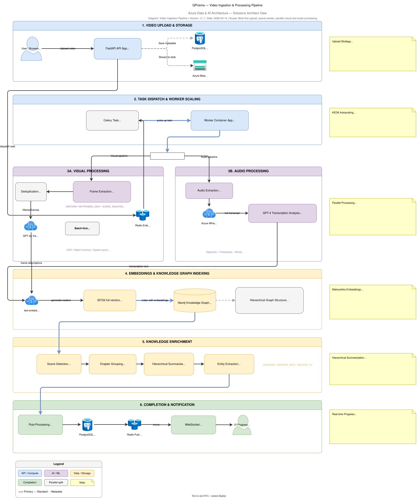

# QPrisma Video Ingestion Architecture

This document explains how QPrisma ingests raw video, transforms it into multimodal knowledge, and publishes processing progress back to the user experience.

## Scope

This view focuses on:

- upload and durable handoff
- asynchronous orchestration
- visual and audio processing branches
- embedding generation and graph indexing
- completion, status tracking, and user notification

It does not attempt to re-document every backend class. For implementation detail, see `docs/BACKEND_ARCHITECTURE.md` and `backend/tasks/video_tasks.py`.

## Related artifacts

- Published diagram asset: `docs/assets/architecture/video-ingestion-pipeline.svg`
- Portfolio index: `docs/ARCHITECTURE_PORTFOLIO.md`
- Technical deep dive: `docs/ARCHITECTURE.md`
- Runtime orchestration: `backend/tasks/video_tasks.py`
- Upload routes: `backend/api/routes/media_routes.py`, `backend/api/routes/chunked_upload_routes.py`

## Architecture style

The ingestion path is best understood as a specialization of the Azure **Web-Queue-Worker** pattern:

- the web/API tier receives and validates uploads
- the queue decouples user-facing traffic from long-running processing
- the worker tier performs CPU and I/O heavy analysis asynchronously

QPrisma extends that baseline with parallel multimodal enrichment, graph indexing, and AI-driven summarization.

## End-to-end flow

| Stage | Primary component | What happens |
|---|---|---|
| Upload | FastAPI + Blob Storage | Raw media is uploaded directly into Azure Blob Storage |
| Metadata registration | FastAPI + PostgreSQL | Media metadata and initial processing state are recorded |
| Async dispatch | API + Redis + Celery | A background job is dispatched to the worker tier |
| Download and extraction | Worker + Blob + FFmpeg/PyAV | The worker downloads the media and extracts frames/audio |
| Visual analysis | Worker + Azure OpenAI Batch | Frames are analyzed for OCR, entities, layout, and actions |
| Audio analysis | Worker + Whisper + GPT analysis | Audio is transcribed and the transcript is summarized |
| Semantic indexing | Embedding service + Neo4j | Embeddings and structured nodes are written to the knowledge graph |
| Enrichment | Summarization + graph builders | Scenes, chapters, entities, communities, and relationships are added |
| Completion | PostgreSQL + Redis Pub/Sub + WebSocket | Final state is persisted and progress/completion is broadcast |

## 1. Upload and durable handoff

QPrisma supports two upload modes:

- `POST /upload` for direct uploads
- `POST /upload/chunked/init` followed by chunk transfer and `POST /upload/chunked/commit` for larger uploads

The architectural goal is the same in both cases: move the raw asset to durable object storage first and keep the API tier short-lived.

### Why this matters

- The API tier stays responsive under large-file workloads.
- Azure Blob Storage becomes the system of record for the raw asset.
- PostgreSQL tracks processing state independently from the object payload.

### Solution Architect takeaway

This separation is important when documenting enterprise ingestion systems: raw binary durability and relational processing state should not be conflated.

## 2. Queue-based orchestration

Once the upload is durably registered, the API tier dispatches a Celery job that ultimately runs `process_video_pipeline`.

The worker tier is the only tier that owns the long-running enrichment path. That design keeps HTTP request latency bounded and allows scaling worker replicas independently from frontend/API replicas.

### Key patterns

- queue-based load leveling through Redis-backed Celery
- background execution in the worker Container App
- KEDA-driven autoscaling based on queue depth
- explicit job progress updates during the pipeline

### Why this matters

This is one of the clearest examples of the repo applying Azure architecture guidance correctly: user interaction and long-running compute are decoupled by design.

## 3. Worker orchestration model

`process_video_pipeline` is the pipeline orchestrator. At a high level it performs the following responsibilities:

1. initialize required services
2. update job status to reflect stage transitions
3. download the video from Blob Storage
4. extract frames and media metadata
5. analyze frames
6. transcribe audio in parallel with batch waiting
7. write semantic outputs and embeddings
8. update final state and publish completion

The orchestration is intentionally centralized so the worker can own end-to-end processing continuity for a single media asset.

## 4. Visual processing branch

The visual branch turns raw frames into structured scene understanding.

### Extraction strategy

The extraction layer uses FFmpeg/PyAV to produce frame samples and quality metadata. QPrisma supports multiple extraction modes so processing can be adapted to the workload:

- uniform sampling
- keyframes-only extraction
- scene-aware extraction
- adaptive extraction
- deeper analysis-oriented extraction

### Cost-aware analysis strategy

Frame analysis is designed around the Azure OpenAI Batch API where possible. This is an explicit cost and throughput optimization:

- lower cost than synchronous per-frame calls
- better handling of large frame sets
- clearer separation between extraction and model execution

### Output shape

The visual branch produces machine-usable outputs such as:

- OCR text
- entities
- scene descriptions
- actions and relationships
- quality indicators and timestamps

## 5. Audio processing branch

Audio processing is intentionally parallel to visual analysis rather than waiting behind it.

The worker extracts audio from the downloaded file, runs transcription, and then performs transcript-level analysis when the transcript has enough substance to be meaningful.

### Runtime behavior

- default cloud transcription path uses Azure Whisper
- local fallback path can use `faster-whisper`
- transcript analysis is separated from raw transcription

### Architectural value

From a Solution Architect perspective, this is a strong example of workload partitioning:

- speech recognition and transcript reasoning are related but different concerns
- they can scale and fail independently from the visual branch
- the pipeline can still produce partial value when one modality is degraded

## 6. Convergence into semantic indexing

After the visual and audio branches finish, the system shifts from media processing to knowledge construction.

### Embeddings

QPrisma generates embeddings through Azure OpenAI and uses a dual-granularity strategy:

- full embeddings for precise semantic ranking
- coarse Matryoshka-style vectors for faster filtering

### Graph indexing

Neo4j stores the semantic representation of the processed asset. The indexed model is hierarchical:

- Video
- Chapter
- Scene
- Frame
- Entity
- AudioSegment
- Topic
- Community

This is not just a storage choice. It is the foundation of the downstream hosted agent retrieval experience.

## 7. Knowledge enrichment after indexing

The ingestion pipeline does more than attach embeddings to content. It also enriches the semantic structure for later retrieval.

Examples include:

- scene detection
- chapter grouping
- hierarchical summaries
- entity extraction and normalization
- semantic relationships
- temporal chains
- community detection
- cross-video entity resolution

This is why QPrisma should be presented as a **knowledge construction pipeline**, not merely as video preprocessing.

## 8. Status, progress, and completion

The worker continuously updates job state as the pipeline advances. This design matters because media processing can be long-running and users need a durable, queryable processing state.

The completion path combines:

- PostgreSQL for final processing status
- Redis Pub/Sub for event propagation
- WebSocket endpoints for real-time UX updates

## Reliability considerations

Key resilience choices visible in the implementation and architecture:

- raw asset durability in Blob Storage before asynchronous processing
- queue-based decoupling between user-facing and worker-facing workloads
- explicit retries and fallback handling in some pipeline stages
- progress visibility instead of black-box batch processing
- partial degradation options across visual and audio sub-flows

## Performance and cost considerations

| Concern | Architectural response |
|---|---|
| Large upload payloads | Blob-first upload strategy and chunked upload support |
| Long-running work | Queue + worker separation |
| AI analysis cost | Batch API usage for frame analysis |
| Pipeline latency | Parallel visual/audio execution where practical |
| Retrieval readiness | Embeddings + graph indexing during ingestion, not at query time |

## Risks and trade-offs

| Trade-off | Benefit | Cost |
|---|---|---|
| Queue-based processing | Better scale isolation and user responsiveness | More distributed system complexity |
| Heavy enrichment during ingestion | Better retrieval quality later | Longer processing time per asset |
| Multiple storage engines | Purpose-fit persistence | More operational surface area |
| Parallel multimodal processing | Lower end-to-end latency | More coordination and failure modes |

## How to present this as a Solution Architect

When presenting the ingestion architecture professionally, emphasize:

1. **architecture style**: Web-Queue-Worker with multimodal enrichment
2. **durability**: Blob Storage is the raw-media system of record
3. **decoupling**: API and worker scale independently
4. **cost discipline**: Batch-first AI processing decisions are intentional
5. **knowledge readiness**: ingestion is designed to feed GraphRAG and hosted-agent retrieval

That framing moves the discussion from "video upload" to "enterprise knowledge extraction pipeline."
